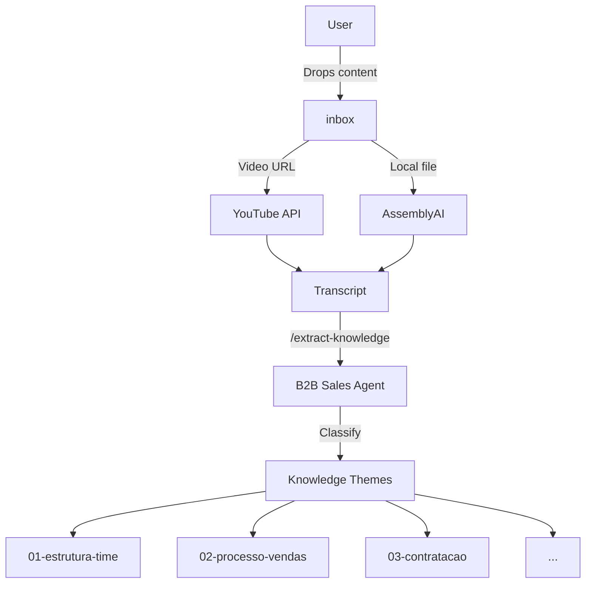

# Create Architecture Documentation

Generate comprehensive architecture documentation for the Mega Brain project.

## Arguments
$ARGUMENTS (optional: --c4-model | --full-suite | --mermaid)

## Allowed Tools
Read, Write, Edit, Bash, Glob, Grep

## What This Command Does

Creates professional architecture documentation including:
- System Context Diagram
- Component Diagrams
- Data Flow Documentation
- Knowledge Taxonomy
- Integration Architecture

## Implementation Steps

### Step 1: Discovery
Scan the project to understand current architecture:
- Read CLAUDE.md for project overview
- Scan .claude/ folder for components
- List KNOWLEDGE/ themes
- Check scripts/ for utilities
- Identify integrations (APIs, MCPs)

### Step 2: Generate System Context

Create `docs/architecture/01-system-context.md`:

```markdown
# Mega Brain - System Context

## Overview
[High-level description of what the system does]

## External Actors
- User: Drops content into INBOX
- YouTube: Source of video transcripts
- AssemblyAI: Transcription service for local files
- Claude Code: AI-powered extraction agent

## System Boundaries
[What's inside vs outside the system]

## Data Flow
```
External Content → INBOX → Transcription → Extraction → KNOWLEDGE
```
```

### Step 3: Component Architecture

Create `docs/architecture/02-components.md`:

```markdown
# Components

## .claude/ Components
| Type | Name | Purpose |
|------|------|---------|
| Agent | b2b-sales-expert | B2B sales analysis |
| Command | /process-video | Video processing |
| Command | /extract-knowledge | Knowledge extraction |
| Command | /scan-inbox | INBOX scanning |
| Skill | video-processing | Transcription |
| Skill | knowledge-extraction | Classification |

## Scripts
| Script | Language | Purpose |
|--------|----------|---------|
| transcribe.py | Python | AssemblyAI integration |
| auto_organize_inbox.py | Python | INBOX scanning |

## Knowledge Themes
[List of 10 theme folders with descriptions]
```

### Step 4: Data Architecture

Create `docs/architecture/03-data-flow.md`:

```markdown
# Data Architecture

## Input Formats
- YouTube URLs
- Local video files (MP4, MP3, WAV, M4A)
- Transcription files (TXT)
- Documents (PDF, DOCX)

## Processing Pipeline
1. Input Detection (URL vs file path)
2. Transcription (youtube-api or AssemblyAI)
3. Theme Classification (keyword matching)
4. Knowledge Extraction (AI-powered)
5. File Organization (by theme)

## Output Format
- Markdown files in KNOWLEDGE/ subfolders
- Standard structure: Resumo, Visao, Fonte
```

### Step 5: Integration Architecture

Create `docs/architecture/04-integrations.md`:

```markdown
# Integrations

## APIs
| Service | Purpose | Auth |
|---------|---------|------|
| YouTube Transcript API | Fetch video transcripts | None |
| AssemblyAI | Transcribe local files | API Key |

## MCPs (Model Context Protocol)
| MCP | Purpose |
|-----|---------|
| filesystem | Local file access |

## Environment Variables
| Variable | Purpose |
|----------|---------|
| ASSEMBLYAI_API_KEY | AssemblyAI authentication |
```

### Step 6: Generate Diagrams (if --mermaid or --full-suite)

Create `docs/architecture/diagrams/`:



## Output

Creates the following structure:
```
docs/
└── architecture/
    ├── 01-system-context.md
    ├── 02-components.md
    ├── 03-data-flow.md
    ├── 04-integrations.md
    └── diagrams/
        └── system-overview.mmd
```

## Usage Examples

```
# Basic documentation
/documentation/create-architecture-documentation

# With Mermaid diagrams
/documentation/create-architecture-documentation --mermaid

# Full documentation suite
/documentation/create-architecture-documentation --full-suite
```
