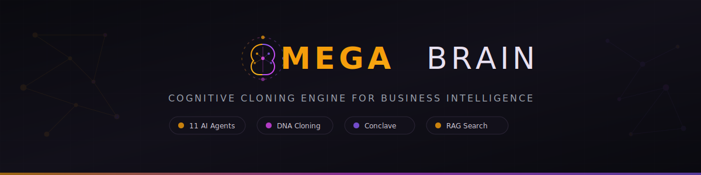

<p align="center">
  
</p>

<p align="center">
  <strong>A maior vantagem competitiva do século.</strong>
  <br>
  <em>Clonagem cognitiva industrial. Agentes que pensam com evidências. Decisões de $100K/hora.</em>
</p>

<p align="center">
  <a href="https://www.npmjs.com/package/mega-brain-ai"></a>
  
  
  
  
</p>

---

<h2 align="center">⚡ Instalação</h2>

```bash
npx mega-brain-ai install
```

<p align="center">
  Requer <a href="https://claude.ai/claude-code">Claude Code</a> (Max ou Pro) + <a href="https://nodejs.org">Node.js 18+</a> + <a href="https://python.org">Python 3.10+</a>
  <br><br>
  <a href="#-instalação-via-npx-recomendado">Ver instalação detalhada</a> · <a href="#-primeiro-uso">Primeiro uso</a> · <a href="#-chaves-de-api">Chaves de API</a>
</p>

---

## 🧭 Navegação Rápida

### O que você gostaria de fazer?

- **[Instalar o Mega Brain](#-instalação-via-npx-recomendado)** — Funcionando em menos de 10 minutos
- **[Entender a promessa](#-a-promessa)** — O que esse sistema faz pelo seu negócio
- **[Ver exemplos reais](#-exemplos-concretos)** — Equipe de tráfego, conteúdo, vendas, conselho
- **[Comparar Community vs Premium](#-premium-vs-gratuito--o-que-você-recebe)** — O que vem em cada edição
- **[Explorar os comandos](#-comandos)** — CLI e slash commands do Claude Code
- **[Entender a arquitetura](#-arquitetura)** — Camadas, diretórios, pipeline
- **[Fazer upgrade para Premium](#-upgrade-para-premium)** — Desbloquear conhecimento pré-processado
- **[Reportar problemas](https://github.com/thiagofinch/mega-brain/issues)** — Bug reports e sugestões

---

## 🧠 A Promessa

Imagine ter na ponta da língua **cada método, cada regra prática, cada modelo de decisão** de todos os especialistas que já estudou, leu, assistiu ou contratou — e poder cruzar esse conhecimento em segundos para tomar a decisão exata que sua empresa precisa agora.

Não amanhã. Não depois de reler 47 PDFs. **Agora.**

O Mega Brain transforma qualquer conteúdo de qualquer especialista — vídeos, cursos, PDFs, podcasts, treinamentos internos, manuais — em **agentes de IA que pensam como aquele expert**. Depois, coloca 11 desses agentes numa mesa de deliberação e faz todos debaterem sua pergunta usando **exclusivamente** os materiais que você inseriu.

Zero achismo. Evidências citadas. O nível de resposta que você obteria numa consultoria de **$100.000 por hora**.

<br>

### ⚡ Mas a promessa vai além

Agora imagine algo mais poderoso: **cada dica, cada sacada valiosa, cada fórmula** de um curso de R$15.000 — transformados automaticamente em **agentes operacionais que trabalham por você**. Não é resumo. Não é anotação. São **habilidades que executam**.

Você insere os conteúdos. O sistema faz o resto.

Cada ensinamento vira uma habilidade. Cada habilidade é distribuída para o agente certo. Cada agente fica mais forte. E de repente, aquele curso que você assistiu há 6 meses não é mais uma memória fragmentada — é um **sistema vivo** que aplica aquele conhecimento nas suas decisões diárias.

E o mais importante: **esses agentes não ficam só analisando**. Eles **operam**. Acessam suas contas. Criam campanhas. Escrevem textos. Publicam conteúdo. Gravam roteiros. Gerenciam sua operação enquanto você dorme.

**A ação é simples: inserir conteúdo. O resultado é exponencial: um exército de agentes especializados operando 24/7 no seu negócio.**

<br>

### 🎯 Exemplo Real: Equipe de Tráfego Pago — Montada Automaticamente

```
Você insere ao longo de 2 semanas:

  → 15 vídeos do Jeremy Haynes sobre anúncios no Facebook
  → Curso completo do Brandon Carter sobre escalar campanhas
  → 8 episódios do Alex Hormozi sobre custo de aquisição de clientes
  → 5 aulas do Jordan Stupar sobre criativos que vendem
  → O relatório da sua última campanha que deu 4.7x de retorno


O QUE ACONTECE:

  O sistema detecta que você acumulou conhecimento suficiente
  sobre Tráfego Pago e monta uma equipe completa:

  ┏━━━━━━━━━━━━━━━━━━━━━━━━━━━━━━━━━━━━━━━━━━━━━━━━━━━━━━━━━┓
  ┃                                                           ┃
  ┃   🎯  EQUIPE CRIADA: TRÁFEGO PAGO                        ┃
  ┃   4 agentes  ·  47 métodos extraídos  ·  5 especialistas ┃
  ┃                                                           ┃
  ┣━━━━━━━━━━━━━━━━━━━━━━━━━━━━━━━━━━━━━━━━━━━━━━━━━━━━━━━━━┫
  ┃                                                           ┃
  ┃   💰  @comprador-de-midia (Midas)                         ┃
  ┃   ┄┄┄┄┄┄┄┄┄┄┄┄┄┄┄┄┄┄┄┄┄┄┄┄┄┄┄┄┄                        ┃
  ┃   Ele OPERA o Gerenciador de Anúncios por você:           ┃
  ┃     ✅ Cria campanhas completas no Facebook/Instagram      ┃
  ┃     ✅ Define públicos usando 28 métodos do Jeremy Haynes  ┃
  ┃     ✅ Distribui orçamento entre conjuntos de anúncios     ┃
  ┃     ✅ Decide quando escalar ou pausar (regras do Hormozi) ┃
  ┃     ✅ Monta funil de aquisição do zero ao fechamento      ┃
  ┃                                                           ┃
  ┃   🎬  @criativo (Nova)                                    ┃
  ┃   ┄┄┄┄┄┄┄┄┄┄┄┄┄┄┄┄┄┄┄┄┄┄┄┄┄┄┄┄┄                        ┃
  ┃   Ele CRIA os anúncios e vídeos por você:                 ┃
  ┃     ✅ Escreve textos de anúncio que param o scroll        ┃
  ┃     ✅ Cria roteiros de Reels, TikTok e Shorts            ┃
  ┃     ✅ Detecta criativo cansado ANTES de cair              ┃
  ┃     ✅ Gera variações de gancho (primeiros 3 segundos)     ┃
  ┃     ✅ Monta briefing completo para designer/videomaker    ┃
  ┃                                                           ┃
  ┃   📊  @analista-performance (Dash)                        ┃
  ┃   ┄┄┄┄┄┄┄┄┄┄┄┄┄┄┄┄┄┄┄┄┄┄┄┄┄┄┄┄┄                        ┃
  ┃   Ele MONITORA suas métricas em tempo real:               ┃
  ┃     ✅ Diagnostica problemas em segundos                   ┃
  ┃     ✅ Aplica regra de custo/retorno do Hormozi            ┃
  ┃     ✅ Calcula quanto você pode pagar por lead/cliente     ┃
  ┃     ✅ Diz se deve pausar, otimizar ou escalar             ┃
  ┃     ✅ Compara seus números com benchmarks dos experts     ┃
  ┃                                                           ┃
  ┃   🔍  @rastreador (Track)                                 ┃
  ┃   ┄┄┄┄┄┄┄┄┄┄┄┄┄┄┄┄┄┄┄┄┄┄┄┄┄┄┄┄┄                        ┃
  ┃   Ele AUDITA seu rastreamento automaticamente:            ┃
  ┃     ✅ Verifica se o pixel está funcionando                ┃
  ┃     ✅ Configura API de conversão                          ┃
  ┃     ✅ Audita atribuição de vendas                         ┃
  ┃     ✅ Identifica onde você perde dados de conversão       ┃
  ┃                                                           ┃
  ┗━━━━━━━━━━━━━━━━━━━━━━━━━━━━━━━━━━━━━━━━━━━━━━━━━━━━━━━━━┛


NA PRÁTICA — Sua campanha cai 30%. O que acontece:

  Você pergunta: "Minha campanha caiu 30% em 3 dias. O que fazer?"

  ┌─────────────────────────────────────────────────────────┐
  │                                                         │
  │  💰 @comprador-de-midia:                                │
  │  "Frequência 4.2 — o público saturou. Pelo método de   │
  │   rotação do Haynes, hora de duplicar o conjunto com    │
  │   novo público lookalike."                              │
  │                                                         │
  │  🎬 @criativo:                                          │
  │  "Criativo com 11 dias rodando. Pelos padrões do       │
  │   Stupar, fadiga começa no dia 7-10. Já preparei       │
  │   3 variações de gancho para testar."                   │
  │                                                         │
  │  📊 @analista-performance:                              │
  │  "Custo por aquisição subiu de R$47 para R$68.         │
  │   Pela regra do Hormozi, o limite saudável é R$58.     │
  │   Recomendo pausar e redistribuir para os conjuntos    │
  │   que ainda estão abaixo do limite."                    │
  │                                                         │
  │  🔍 @rastreador:                                        │
  │  "Pixel OK. Mas 23% de conversões sem atribuição.      │
  │   Pode ser que a queda seja menor do que parece."       │
  │                                                         │
  └─────────────────────────────────────────────────────────┘

  4 agentes. 4 diagnósticos especializados. 1 plano de ação.
  Em segundos. Sem pagar consultoria.
```

<br>

### 📱 Exemplo Real: Equipe de Conteúdo — Da Ideia ao Post Publicado

```
Você insere ao longo de 3 semanas:

  → 10 vídeos do Dan Koe sobre criar conteúdo sozinho
  → Aulas de copywriting do Gary Halbert (o melhor da história)
  → Treinamento de vendas por conteúdo do Expert X
  → 12 episódios sobre como escrever ganchos e contar histórias
  → Seus próprios posts que tiveram mais curtidas e comentários


O SISTEMA MONTA SUA EQUIPE DE CONTEÚDO:

  ┏━━━━━━━━━━━━━━━━━━━━━━━━━━━━━━━━━━━━━━━━━━━━━━━━━━━━━━━━━┓
  ┃                                                           ┃
  ┃   📱  EQUIPE CRIADA: GESTÃO DE CONTEÚDO                   ┃
  ┃   5 agentes  ·  Ciclo completo: ideia → publicação        ┃
  ┃                                                           ┃
  ┣━━━━━━━━━━━━━━━━━━━━━━━━━━━━━━━━━━━━━━━━━━━━━━━━━━━━━━━━━┫
  ┃                                                           ┃
  ┃   ✍️  @redator (Quill) — ESCREVE por você                 ┃
  ┃   ┄┄┄┄┄┄┄┄┄┄┄┄┄┄┄┄┄┄┄┄┄┄┄┄┄┄┄┄┄┄┄┄┄┄┄┄┄                ┃
  ┃     ✅ Legendas para Instagram, LinkedIn, Twitter          ┃
  ┃     ✅ Fórmulas do Gary Halbert para títulos matadores     ┃
  ┃     ✅ Adapta tom para cada rede automaticamente           ┃
  ┃     ✅ Mantém a VOZ DA SUA MARCA                           ┃
  ┃                                                           ┃
  ┃   📅  @planejador (Muse) — PLANEJA seu calendário         ┃
  ┃   ┄┄┄┄┄┄┄┄┄┄┄┄┄┄┄┄┄┄┄┄┄┄┄┄┄┄┄┄┄┄┄┄┄┄┄┄┄                ┃
  ┃     ✅ Calendário de conteúdo de 30 dias                   ┃
  ┃     ✅ Distribui formatos: post, carrossel, vídeo, stories ┃
  ┃     ✅ Alinha com datas importantes do seu nicho            ┃
  ┃     ✅ Reusa conteúdos antigos de sucesso                   ┃
  ┃                                                           ┃
  ┃   🎨  @designer (Pixel) — DIRIGE o visual                 ┃
  ┃   ┄┄┄┄┄┄┄┄┄┄┄┄┄┄┄┄┄┄┄┄┄┄┄┄┄┄┄┄┄┄┄┄┄┄┄┄┄                ┃
  ┃     ✅ Briefings visuais alinhados com a copy              ┃
  ┃     ✅ Layout de carrosséis que prendem atenção            ┃
  ┃     ✅ Aplica identidade visual da sua marca               ┃
  ┃     ✅ Miniaturas de vídeo que geram cliques               ┃
  ┃                                                           ┃
  ┃   🎬  @videomaker (Reel) — ROTEIRIZA seus vídeos          ┃
  ┃   ┄┄┄┄┄┄┄┄┄┄┄┄┄┄┄┄┄┄┄┄┄┄┄┄┄┄┄┄┄┄┄┄┄┄┄┄┄                ┃
  ┃     ✅ Roteiros de Reels, Shorts e TikTok prontos         ┃
  ┃     ✅ Gancho nos 3 primeiros segundos que prende          ┃
  ┃     ✅ Marcações de corte e texto na tela                  ┃
  ┃     ✅ Otimiza para retenção máxima                        ┃
  ┃                                                           ┃
  ┃   📤  @publicador (Feed) — PUBLICA e AGENDA               ┃
  ┃   ┄┄┄┄┄┄┄┄┄┄┄┄┄┄┄┄┄┄┄┄┄┄┄┄┄┄┄┄┄┄┄┄┄┄┄┄┄                ┃
  ┃     ✅ Define melhor horário para cada rede                ┃
  ┃     ✅ Adapta o conteúdo para cada plataforma              ┃
  ┃     ✅ Hashtags estratégicas por nicho                     ┃
  ┃     ✅ Agenda toda a semana de uma vez                     ┃
  ┃                                                           ┃
  ┗━━━━━━━━━━━━━━━━━━━━━━━━━━━━━━━━━━━━━━━━━━━━━━━━━━━━━━━━━┛


NA PRÁTICA — Sua segunda-feira de manhã:

  ┌─────────────────────────────────────────────────────────┐
  │                                                         │
  │  08:00  📅 @planejador:                                 │
  │         "Tema da semana: autoridade técnica.            │
  │          3 posts, 1 carrossel, 1 Reel."                 │
  │                                                         │
  │  08:05  ✍️ @redator:                                    │
  │         "Pronto. 3 legendas + 1 copy de carrossel       │
  │          com 7 slides + 1 gancho de Reel."              │
  │                                                         │
  │  08:10  🎨 @designer:                                   │
  │         "Briefing visual dos 3 posts + layout do        │
  │          carrossel + miniatura do Reel prontos."         │
  │                                                         │
  │  08:15  🎬 @videomaker:                                 │
  │         "Roteiro do Reel (47s): gancho, 3 blocos,       │
  │          CTA no final. Marcações de corte incluídas."   │
  │                                                         │
  │  08:20  📤 @publicador:                                 │
  │         "Semana agendada:                               │
  │          · Terça 11h30 — Post autoridade                │
  │          · Quarta 18h — Carrossel educativo             │
  │          · Quinta 7h — Reel (horário de pico)           │
  │          · Sexta 12h — Post storytelling                │
  │          · Sábado 9h — Stories bastidores"              │
  │                                                         │
  └─────────────────────────────────────────────────────────┘

  Você acorda. Abre o painel. Tudo pronto.
  Revisa em 10 minutos. Aprova. Publica.

  Sua semana inteira de conteúdo — planejada, escrita,
  com visual definido e agendada — antes do café da manhã.

  Sem contratar social media. Sem copywriter.
  Sem videomaker. Sem designer.

  Seus agentes aprenderam com os MELHORES do mundo.
  E trabalham para VOCÊ.
```

<br>

**Isso é o Mega Brain.** Não é mais sobre "usar IA para fazer coisas". É sobre construir um **sistema de inteligência** que cresce com cada conteúdo que você insere, até que a distância entre você e qualquer concorrente se torne impossível de alcançar.

---

## 🔴 O Problema

Você já investiu dezenas (talvez centenas) de milhares de reais em conhecimento. Cursos, mentorias, livros, eventos, masterminds.

E tudo isso vive espalhado entre:

- 📂 Anotações que você não relembra
- 🎬 Vídeos que você assistiu uma vez e esqueceu 80%
- 📄 PDFs que ficam juntando poeira digital
- 💡 Fórmulas brilhantes que você aplicou por 2 semanas e abandonou
- 💬 Sacadas de conversas que evaporaram

**O problema não é falta de conhecimento. É a incapacidade humana de cruzar tudo ao mesmo tempo.**

Seu cérebro não foi desenhado para manter 47 métodos na ponta da língua, comparar 12 modelos de decisão simultaneamente e aplicar a fórmula certa no momento certo.

Mas uma máquina foi.

---

## 🟢 A Solução

O Mega Brain é uma **máquina de clonagem cognitiva industrial**.

Você insere os conteúdos. O sistema extrai o **DNA Cognitivo** em 5 camadas (as fórmulas de pensamento do especialista). E devolve um agente que **pensa, fala e decide** como aquele expert — fundamentado em evidências, não em aproximações.

Depois, esses agentes são distribuídos em **cargos operacionais** dentro do seu negócio:

- 💰 Um **Diretor de Receita** que responde sobre faturamento usando os métodos do Alex Hormozi
- 🤝 Um **Vendedor** que conduz objeções usando a técnica de perguntas do Jeremy Miner
- 📣 Um **Diretor de Marketing** que planeja campanhas usando os 47 métodos do Jeremy Haynes
- 🏛️ Um **Conselho** com 11 agentes que debate qualquer decisão estratégica em 4 fases

E a parte que muda tudo: **quanto mais material você insere, mais forte o sistema fica**. Cada vídeo novo, cada PDF processado, cada treinamento adicionado — o DNA é recalculado, os agentes ficam mais precisos, as conexões cruzadas se multiplicam.

É uma vantagem que cresce exponencialmente. E impossível copiar.

---

## 📋 Exemplos Concretos

Não acredite no que dizemos. Veja o que acontece.

<br>

### 🔬 Exemplo 1: Clonando um Especialista de Vendas

```
ENTRADA:  20 vídeos do Cole Gordon sobre gestão de equipe de vendas
          + Curso completo (Paid Traffic Mastery Academy)
          + 8 episódios de podcast

PROCESSO: /ingest [URLs] → /process-jarvis → /extract-dna cole-gordon

SAÍDA:    DNA Cognitivo com 5 camadas extraídas:

          · Camada 1 (Filosofias):
            "Receita é resultado de sistema, não de talento"

          · Camada 2 (Modelos de Decisão):
            Método PTMA, Matriz de Ofertas

          · Camada 3 (Regras Práticas):
            "Se o vendedor erra 3x a mesma objeção, é treino, não coaching"

          · Camada 4 (Métodos):
            14 métodos documentados com passos acionáveis

          · Camada 5 (Processos):
            Processo de contratar, treinar e reter vendedores

RESULTADO: Seu agente @closer agora responde perguntas como:
           "Meu vendedor está fechando 18%. O que fazer?"

           → Usando o método exato do Cole Gordon, com evidências citadas.
```

<br>

### 🏢 Exemplo 2: Extraindo o Invisível da Sua Própria Empresa

```
ENTRADA:  Gravações de reuniões de estratégia (12 horas)
          + Manual interno do produto
          + Treinamentos que você gravou pro time
          + Documentos de integração de funcionários novos

PROCESSO: /ingest [arquivos] → /process-jarvis

SAÍDA:    O sistema identifica 47 métodos implícitos que você usava
          sem saber que estavam lá:

          · Um modelo de qualificação que você criou intuitivamente
          · Uma regra de precificação que aparece em 8 reuniões
          · Um padrão de decisão que você repete em toda contratação
          · Processos de entrega que ninguém documentou

RESULTADO: Conhecimento tácito → conhecimento explícito.
           Tudo documentado. Tudo replicável. Tudo na ponta da língua.
```

<br>

### 🏛️ Exemplo 3: O Conselho em Ação

```
ENTRADA:  /conclave "Devo mudar meu sistema de assinaturas
                     de pequenas empresas para grandes?"

FASE 1 — DIRETORES:

  💰 Diretor de Receita:
     "Os dados de retenção mostram que grandes empresas ficam 4.7x mais
      tempo. Mas o custo de aquisição sobe 12x. Pelo método do Hormozi,
      você precisa de R$1.7M de receita mensal antes de fazer sentido."

  💵 Diretor Financeiro:
     "Seu caixa aguenta 6 meses de ciclo de venda para grandes empresas.
      A margem cai de 78% para 61% nos primeiros 18 meses."

  📣 Diretor de Marketing:
     "Posicionamento atual é 100% autoatendimento. Grandes empresas exigem
      venda consultiva + prospecção ativa. Reconstrução completa de canal."

  ⚙️ Diretor de Operações:
     "Time de 4 pessoas não suporta entrega para grandes empresas.
      Mínimo 2 contratações antes da mudança."

FASE 2 — OPERACIONAIS:

  🤝 Vendedor:
     "Venda para grande empresa = 6 reuniões. Nosso processo tem 2.
      Lacuna crítica."

  📞 Prospectador:
     "Lista viável: 340 empresas no perfil ideal. Cadência de prospecção
      = 14 etapas. Precisamos de ferramenta."

FASE 3 — CONSELHO:

  🔬 Crítico:
     "A evidência suporta a mudança, mas não agora.
      Pré-requisitos não estão satisfeitos."

  😈 Advogado do Diabo:
     "Risco de perder base atual durante transição.
      Reversibilidade: baixa. Zona morta de 8 meses."

  🎯 Sintetizador:
     "RECOMENDAÇÃO: Não mudar agora. Criar faixa paralela para grandes
      empresas com 1 vendedor dedicado. Critério: 3 contratos fechados
      em 90 dias para validar antes de apostar tudo."

GRAU DE CONFIANÇA: 87%  |  CONSENSO: 9 de 11 agentes
```

<br>

### 🔄 Exemplo 4: Agentes que Ficam Mais Fortes Sozinhos

```
ENTRADA:  Você insere 5 novos vídeos do Alex Hormozi
          sobre Ofertas Irresistíveis

O QUE ACONTECE AUTOMATICAMENTE:

  1. DNA do Hormozi é recalculado (5 camadas atualizadas)

  2. Método "Oferta Irresistível" é extraído com todos os passos

  3. O método é AUTOMATICAMENTE distribuído para:
     → 💰 Diretor de Receita — como habilidade de precificação
     → 🤝 Vendedor — como técnica de empilhar valor
     → 📞 Prospectador — como posicionamento no primeiro contato

  4. No próximo Conselho, esses métodos já estão disponíveis
     para todos os agentes usarem na deliberação

ZERO CONFIGURAÇÃO MANUAL.

Você inseriu o conteúdo. Os agentes ficaram mais fortes. Ponto.
```

<br>

### 📊 Exemplo 5: De Um Vídeo a Habilidades Distribuídas

```
ENTRADA:  1 vídeo de 40 minutos do Jeremy Haynes
          sobre "Como Testar Criativos no Facebook"

PROCESSAMENTO AUTOMÁTICO (5 fases):

  Fase 1 — Divisão:        23 segmentos semânticos
  Fase 2 — Identificação:  7 entidades únicas identificadas
  Fase 3 — Extração:       5 sacadas acionáveis priorizadas
  Fase 4 — Síntese:        Narrativa consolidada com fontes
  Fase 5 — Compilação:     Manual prático + Habilidades geradas

SAÍDA — 5 habilidades acionáveis extraídas:

  1. "Matriz de Teste de Ganchos"
     → distribuída para o Diretor de Marketing

  2. "Detecção de Cansaço do Criativo"
     → distribuída para o Diretor de Marketing

  3. "Árvore de Decisão: Pausar ou Escalar"
     → distribuída para o Diretor de Receita

  4. "Alocação de Orçamento por Etapa do Funil"
     → distribuída para o Diretor Financeiro

  5. "Protocolo de Velocidade de Iteração"
     → distribuída para o Diretor de Operações

UM VÍDEO DE 40 MINUTOS → 5 HABILIDADES → 4 AGENTES MAIS FORTES
```

---

## 🔬 Clonagem Mental — Como Funciona

O processador JARVIS (Just A Rather Very Intelligent System) é o coração do Mega Brain. Ele transforma material bruto em conhecimento acionável através de 5 fases:

```
             Seus materiais brutos
       (vídeos, PDFs, cursos, podcasts,
        treinamentos, reuniões, manuais)
                     │
                     ▼
  ┏━━━━━━━━━━━━━━━━━━━━━━━━━━━━━━━━━━━━━━━━┓
  ┃      🧠 PROCESSADOR JARVIS (5 Fases)    ┃
  ┣━━━━━━━━━━━━━━━━━━━━━━━━━━━━━━━━━━━━━━━━┫
  ┃                                          ┃
  ┃  Fase 1 │ DIVISÃO                        ┃
  ┃         │ Quebra cada material em blocos  ┃
  ┃         │ coerentes de ideias             ┃
  ┃                                          ┃
  ┃  Fase 2 │ IDENTIFICAÇÃO                  ┃
  ┃         │ Identifica quem disse o quê:    ┃
  ┃         │ pessoas, métodos, conceitos     ┃
  ┃                                          ┃
  ┃  Fase 3 │ EXTRAÇÃO                       ┃
  ┃         │ Extrai sacadas acionáveis       ┃
  ┃         │ Prioriza por impacto            ┃
  ┃                                          ┃
  ┃  Fase 4 │ SÍNTESE                        ┃
  ┃         │ Consolida narrativas por        ┃
  ┃         │ pessoa e por tema               ┃
  ┃                                          ┃
  ┃  Fase 5 │ COMPILAÇÃO                     ┃
  ┃         │ Gera dossiês, manuais e         ┃
  ┃         │ distribui habilidades para      ┃
  ┃         │ os agentes certos               ┃
  ┃                                          ┃
  ┗━━━━━━━━━━━━━━━━━━━━━━━━━━━━━━━━━━━━━━━━┛
                     │
                     ▼
  ┏━━━━━━━━━━━━━━━━━━━━━━━━━━━━━━━━━━━━━━━━┓
  ┃       ✅ RESULTADOS GERADOS              ┃
  ┣━━━━━━━━━━━━━━━━━━━━━━━━━━━━━━━━━━━━━━━━┫
  ┃  🧬 DNA Cognitivo (5 camadas)            ┃
  ┃  🤖 Agente Especializado (clone mental)  ┃
  ┃  📖 Dossiê Completo (todas habilidades)  ┃
  ┃  📋 Manuais Práticos (passo a passo)     ┃
  ┃  ⚡ Habilidades Distribuídas (por agente) ┃
  ┃  🔍 RAG Indexado (BM25 + semântico)      ┃
  ┗━━━━━━━━━━━━━━━━━━━━━━━━━━━━━━━━━━━━━━━━┛
```

<br>

### 🧬 DNA Cognitivo — 5 Camadas de Pensamento

Cada especialista clonado tem seu DNA extraído em 5 camadas progressivas, da mais abstrata (como ele **pensa**) até a mais concreta (como ele **faz**):

| Camada | Nome | O que Captura | Exemplo Real |
|:------:|------|---------------|-------------|
| **1** | Filosofias | Crenças fundamentais e visão de mundo | *"Receita é resultado de sistema, não de talento individual"* |
| **2** | Modelos de Decisão | Como ele avalia situações e decide | *"Toda oferta deve resolver dor, sonho ou obstáculo"* |
| **3** | Regras Práticas | Atalhos de decisão do dia a dia | *"Se o retorno é menor que 3x, não escale — otimize"* |
| **4** | Métodos | Processos validados com passos definidos | *Oferta Irresistível: 4 componentes, 7 passos, 3 testes* |
| **5** | Processos | Execução passo a passo, pronta para replicar | *"Dia 1: definir resultado dos sonhos. Dia 2: listar obstáculos..."* |

> A diferença entre "ter assistido um vídeo do Hormozi" e "ter o DNA do Hormozi operando no seu negócio" é a distância entre anotar uma frase e ter um sistema que **aplica** aquela frase em cada decisão relevante automaticamente.

---

## 🤖 Agentes que Pensam — e que Operam

Após clonar especialistas, o sistema distribui o conhecimento para **11 agentes operacionais** que trabalham no seu negócio. Cada agente carrega um **DNA Híbrido** — uma combinação dos métodos de todos os experts que você clonou.

<br>

### 👔 Diretores — Estratégia e Decisão

| Agente | Cargo | Especialidade | Exemplo de Pergunta |
|:------:|-------|---------------|---------------------|
| 💰 **CRO** | Diretor de Receita | Precificação, crescimento, ofertas | *"Devo aumentar preço ou volume?"* |
| 💵 **CFO** | Diretor Financeiro | Margens, retorno, fluxo de caixa | *"Quanto posso investir em anúncios esse mês?"* |
| 📣 **CMO** | Diretor de Marketing | Posicionamento, canais, campanhas | *"Qual canal priorizar com R$50K?"* |
| ⚙️ **COO** | Diretor de Operações | Processos, entrega, times | *"Como escalar entrega sem contratar?"* |

<br>

### 🤝 Vendas — Execução Operacional

| Agente | Cargo | Especialidade | Exemplo de Pergunta |
|:------:|-------|---------------|---------------------|
| 🤝 **Closer** | Vendedor | Fechamento, objeções, negociação | *"O cliente disse que está caro. O que faço?"* |
| 📞 **BDR** | Prospectador | Primeiro contato, qualificação | *"Como abordar o dono de empresa de R$10M?"* |
| 🎯 **SDS** | Qualificador | Diagnóstico, perguntas certas | *"Quais perguntas fazer nos primeiros 5 minutos?"* |
| 💌 **LNS** | Relacionamento | Nutrição de leads, reativação | *"Lead esfriou há 30 dias. Como reativar?"* |

<br>

### 🏛️ Conselho de Deliberação (Conclave)

| Agente | Cargo | O que Faz |
|:------:|-------|-----------|
| 🔬 **Crítico** | Auditor de Lógica | Verifica se os argumentos são fundamentados nos materiais |
| 😈 **Advogado do Diabo** | Destruidor de Ideias Fracas | Encontra falhas, contra-argumentos e pontos cegos |
| 🎯 **Sintetizador** | Integrador Final | Junta todas as perspectivas num plano acionável |

---

## 📈 O Efeito Composto

O Mega Brain não é um sistema que você "usa". É um sistema que **cresce**.

```
Dia 1:    5 vídeos inseridos
          → DNA básico, poucos métodos
          → Respostas úteis mas limitadas

Mês 1:    50 conteúdos processados
          → 3 especialistas clonados
          → Conexões cruzadas começam a aparecer
          → Conselho já produz sacadas valiosas

Mês 3:    200+ conteúdos processados
          → 8 especialistas com DNA profundo
          → Agentes com DNA Híbrido rico
          → Conselho cruza métodos entre especialistas
          → Sacadas que NENHUM humano conseguiria sozinho

Mês 6:    500+ conteúdos processados
          → Ecossistema completo de conhecimento
          → Agentes com respostas de nível consultoria
          → Sua empresa tem vantagem impossível de copiar
```

**A curva é exponencial porque as conexões crescem geometricamente.** Com 3 especialistas, você tem 3 combinações. Com 8, você tem 28. Com 15, são 105 combinações possíveis de conhecimento cruzado.

Cada combinação é uma vantagem que seus concorrentes não têm. E não podem copiar. Porque precisariam inserir os mesmos materiais, ter as mesmas fontes, e alimentar por meses.

---

## ⭐ PREMIUM vs Gratuito — O que Você Recebe

O Mega Brain existe em duas versões. A diferença? **Uma é a máquina. A outra é a máquina com o cérebro ligado.**

<br>

<table>
<tr>
<td width="50%" valign="top">

### 🆓 Gratuito (Community)

**A estrutura. O esqueleto. A máquina desligada.**

- ⚙️ Processador JARVIS (mecanismo de ingestão)
- 🔧 105 skills + 50 comandos + 42 hooks
- 🤖 Automações e gatilhos inteligentes
- 🏛️ Sistema do Conselho (protocolo de deliberação)
- 🔍 RAG com 3 pipelines (BM25, semântico, grafo)
- 📋 Templates de agentes e protocolos
- 📁 Estrutura de pastas e modelos vazios
- 🎯 GSD (Get Shit Done) — workflow de execução

**Você recebe o motor. Mas sem combustível.**

Ideal para quem quer construir tudo do zero, inserindo seus próprios materiais e alimentando o sistema ao longo de meses.

```
🆓 Gratuito = Motor + Chassi + Painel
              (você fornece o combustível)
```

</td>
<td width="50%" valign="top">

### 💎 PREMIUM (MoneyClub)

**Tudo do Gratuito + o cérebro já operacional.**

- 🧬 **Mentes Clonadas** de especialistas reais (DNA extraído)
- 🤖 **Agentes Operacionais** (4 Diretores + Equipe de Vendas)
- 💰 **+$500 mil dólares em conteúdo pago** já processado
- ⚡ **47+ métodos** de 15+ especialistas acionáveis
- 📖 **Manuais Práticos** completos com passos documentados
- 🗺️ **Mapa de Conhecimento** com 600+ nós e 2.600+ conexões
- 📚 **Dossiês** compilados por especialista
- 🧬 **DNAs Híbridos** pré-configurados por cargo
- ⭐ **14 skills premium** adicionais

**Você recebe o motor JÁ LIGADO. Com combustível premium.**

É como a diferença entre receber um escritório vazio e receber um escritório com 11 pessoas já treinadas, com manuais na mão, prontas para trabalhar.

```
💎 PREMIUM = Motor + Chassi + Painel
             + Equipe de 11 agentes treinados
             + 47 métodos carregados
             + 6 meses de vantagem competitiva
```

</td>
</tr>
</table>

<br>

| Recurso | 🆓 Gratuito | 💎 PREMIUM |
|---------|:----------:|:---------:|
| Processador JARVIS (5 fases) | ✅ | ✅ |
| 105 skills + 50 comandos + 42 hooks | ✅ | ✅ |
| Automações e gatilhos | ✅ | ✅ |
| Sistema do Conselho | ✅ | ✅ |
| RAG (BM25, semântico, grafo de conhecimento) | ✅ | ✅ |
| Templates e protocolos | ✅ | ✅ |
| GSD workflow (plan → execute → validate) | ✅ | ✅ |
| Mentes Clonadas (DNA Cognitivo) | — | **15+ especialistas** |
| Diretores operacionais | — | **Receita, Financeiro, Marketing, Operações** |
| Equipe de Vendas (4 agentes) | — | **Vendedor, Prospectador, Qualificador, Relacionamento** |
| +$500 mil dólares em conteúdo processado | — | **✅ Incluído** |
| 47+ métodos acionáveis | — | **✅ Incluído** |
| Mapa de Conhecimento (600+ nós) | — | **✅ Incluído** |
| Manuais passo a passo | — | **✅ Incluído** |
| Dossiês por especialista | — | **✅ Incluído** |
| 14 skills premium exclusivas | — | **✅ Incluído** |
| Suporte MoneyClub | — | **✅ Incluído** |

<br>

> **A matemática é simples.** Você pode passar 6 meses inserindo conteúdo, processando, refinando e construindo do zero. Ou pode começar com 6 meses de vantagem — com tudo já processado, pronto para usar, e ir acumulando em cima.
>
> O Gratuito é poderoso. O PREMIUM é **imparável**.
>
> 💎 [Acesse o PREMIUM completo](https://moneyclub.thiagofinch.com)

---

## 🚀 Instalação via NPX (Recomendado)

**Instale o Mega Brain com um único comando:**

```bash
npx mega-brain-ai install
```

O assistente interativo guia você por todo o processo:

```
$ npx mega-brain-ai install meu-brain

  ███╗   ███╗███████╗ ██████╗  █████╗
  ████╗ ████║██╔════╝██╔════╝ ██╔══██╗
  ██╔████╔██║█████╗  ██║  ███╗███████║
  ██║╚██╔╝██║██╔══╝  ██║   ██║██╔══██║
  ██║ ╚═╝ ██║███████╗╚██████╔╝██║  ██║
  ╚═╝     ╚═╝╚══════╝ ╚═════╝ ╚═╝  ╚═╝
         B  R  A  I  N

  Bem-vindo ao instalador do Mega Brain!

  [1/5] Selecione sua Edição

  ┏━━━━━━━━━━━━━━━━━━━━━━━━━━━━━━━━━━━━━━━━━━━━━━━━━━━━━━━━━━┓
  ┃                                                            ┃
  ┃   [1]  💎 PREMIUM — Membro MoneyClub                       ┃
  ┃        O sistema COMPLETO com o cérebro ligado.            ┃
  ┃        Mentes Clonadas, Agentes Operacionais,              ┃
  ┃        +$500 mil dólares em conteúdo processado.           ┃
  ┃                                                            ┃
  ┃   [2]  🆓 COMMUNITY — A Máquina sem Cérebro               ┃
  ┃        105 skills, 50 comandos, 42 hooks.                  ┃
  ┃        Sem conteúdo pré-carregado.                         ┃
  ┃                                                            ┃
  ┗━━━━━━━━━━━━━━━━━━━━━━━━━━━━━━━━━━━━━━━━━━━━━━━━━━━━━━━━━━┛

  Sua escolha (1/2): 1

  [2/5] Validação de Acesso Premium

  Digite o email cadastrado no MoneyClub: usuario@email.com
  Verificando...

  ✅ Bem-vindo, João! Acesso PREMIUM confirmado. (Instalação #1)

  [3/5] Diretório de Instalação

  Onde deseja instalar o Mega Brain?
  [1] Diretório atual (.)
  [2] Novo diretório (./mega-brain)
  [3] Caminho personalizado

  Escolha (1/2/3): 2

  [4/5] Instalando estrutura base...
  ✅ Estrutura base instalada com sucesso!

  [5/5] Baixando conteúdo PREMIUM...
  ✅ Conteúdo PREMIUM instalado com sucesso!

  ┏━━━━━━━━━━━━━━━━━━━━━━━━━━━━━━━━━━━━━━━━━━━━━━━━━━━━━━━━━━┓
  ┃                                                            ┃
  ┃  ✅ Mega Brain PREMIUM instalado com sucesso!               ┃
  ┃                                                            ┃
  ┃  Próximo passo:                                            ┃
  ┃  Abra o projeto no Claude Code e o JARVIS                  ┃
  ┃  irá se apresentar automaticamente.                        ┃
  ┃                                                            ┃
  ┃  Comandos iniciais:                                        ┃
  ┃    /conclave "sua pergunta"   — Deliberação estratégica    ┃
  ┃    /ingest [URL/arquivo]      — Alimentar o sistema        ┃
  ┃    /deep-research [tema]      — Pesquisa profunda          ┃
  ┃                                                            ┃
  ┗━━━━━━━━━━━━━━━━━━━━━━━━━━━━━━━━━━━━━━━━━━━━━━━━━━━━━━━━━━┛
```

<br>

### ✨ O Que o Instalador Faz

- ✅ Baixa a versão mais recente do NPM
- ✅ Pergunta qual edição você quer (PREMIUM ou Community)
- ✅ Valida seu acesso MoneyClub (se PREMIUM)
- ✅ Cria toda a estrutura de pastas e protocolos
- ✅ Baixa conteúdo PREMIUM (mentes clonadas, métodos, dossiês)
- ✅ Configura os 42 hooks + 105 skills + 50 comandos automaticamente
- ✅ Funciona em Windows, macOS e Linux

<br>

### 🔄 Atualizando uma Instalação Existente

```bash
npx mega-brain-ai@latest install
```

Isto vai:

- ✅ Detectar automaticamente sua instalação existente
- ✅ Atualizar apenas os arquivos que mudaram
- ✅ Preservar todo o seu conteúdo e configurações pessoais (L3)
- ✅ Baixar novos métodos e atualizações de DNA (se PREMIUM)

<br>

### 🔼 Upgrade para Premium

Já instalou a versão Community e quer o cérebro ligado?

```bash
npx mega-brain-ai upgrade
```

Digite seu email de membro quando solicitado. O instalador busca o conteúdo premium e integra à sua instalação existente sem tocar nos seus dados pessoais.

```bash
# Verificar status da licença
npx mega-brain-ai status

# Ver features disponíveis vs bloqueadas
npx mega-brain-ai features
```

<br>

### 📋 Requisitos

| Dependência | Versão | Obrigatória? |
|-------------|--------|:------------:|
| **[Claude Code](https://claude.ai/claude-code)** | Última versão | ✅ Sim (assinatura Max ou Pro) |
| **[Node.js](https://nodejs.org)** | 18+ (v20+ recomendado) | ✅ Sim |
| **[Python](https://python.org)** | 3.10+ | ✅ Sim |
| **Chave OpenAI** | — | ✅ Sim (para transcrição de áudio/vídeo) |

---

## ⚡ Primeiro Uso

Após instalar, abra o projeto no [Claude Code](https://claude.ai/claude-code) e execute:

```
/setup
```

O assistente guia você em 6 etapas:

| Etapa | O que Configura |
|:-----:|-----------------|
| 1 | ✅ Verifica Python 3.10+ |
| 2 | ✅ Verifica Node.js 18+ |
| 3 | ✅ Instala dependências do Python |
| 4 | 🔑 Configura Chaves de API (com explicação de cada uma) |
| 5 | 🔗 Valida conexões com as APIs |
| 6 | ⚙️ Gera arquivo de configuração `.env` |

<br>

### 🔑 Chaves de API

| Chave | Obrigatória? | Para que Serve |
|-------|:-----------:|----------------|
| `OPENAI_API_KEY` | **✅ Sim** | Transcrição de vídeos e áudios (Whisper). Essencial para `/ingest` |
| `VOYAGE_API_KEY` | 💡 Recomendada | Busca inteligente — permite que agentes encontrem evidências nos materiais |
| `ANTHROPIC_API_KEY` | ❌ Não* | Não necessária com Claude Code Max/Pro. Apenas para automações avançadas |
| `GOOGLE_CLIENT_*` | ❌ Não | Importar conteúdos direto do Google Drive |

*\*Se você usa Claude Code via assinatura Max ou Pro, o acesso ao Claude já está incluído.*

---

## 🎮 Comandos

### 🖥️ Terminal CLI

```bash
# Instalação e Setup
npx mega-brain-ai install [nome]      # Assistente interativo de instalação
npx mega-brain-ai setup               # Configurar chaves de API
npx mega-brain-ai upgrade             # Upgrade Community → Premium

# Licença e Features
npx mega-brain-ai status              # Status da licença e edição
npx mega-brain-ai features            # Features disponíveis vs bloqueadas
npx mega-brain-ai validate <email>    # Revalidar email de membro

# Push (3 camadas)
mega-brain-push                       # Seleção interativa de camada
mega-brain-push --layer 1             # Push público (npm/origin)
mega-brain-push --layer 2             # Push premium (repo privado)
mega-brain-push --layer 3             # Backup completo
mega-brain-push --dry-run             # Simular sem executar
```

<br>

### 📥 Inserir e Processar Conteúdo

| Comando | O que Faz |
|---------|-----------|
| `/ingest [URL ou arquivo]` | Insere novo material (YouTube, PDF, texto, áudio) |
| `/process-jarvis` | Processa tudo pelo pipeline de 5 fases |
| `/extract-dna [especialista]` | Extrai DNA Cognitivo de um especialista |
| `/clone-mind` | Cria clone mental completo de um expert |

<br>

### 🔍 Consultar e Decidir

| Comando | O que Faz |
|---------|-----------|
| `/jarvis-briefing` | Resumo operacional + nota de saúde do sistema |
| `/conclave [pergunta]` | Deliberação com 11 agentes em múltiplas fases |
| `/deep-research [tema]` | Pesquisa profunda usando base de conhecimento |

<br>

### ⚙️ Sistema

| Comando | O que Faz |
|---------|-----------|
| `/setup` | Configuração inicial (assistente guiado) |
| `/save` | Salvar sessão atual |
| `/resume` | Retomar sessão anterior |

> 💡 Digite `*help` dentro de qualquer contexto de agente para ver comandos específicos.

---

## 🏃 Início Rápido — 5 Minutos

### 1️⃣ Insira seu primeiro conteúdo

```
/ingest https://youtube.com/watch?v=SEU_VIDEO_AQUI
```

### 2️⃣ Processe com o JARVIS

```
/process-jarvis
```

### 3️⃣ Veja o resultado

```
/jarvis-briefing
```

### 4️⃣ Consulte o Conselho

```
/conclave "Qual a melhor estratégia de aquisição de clientes para os próximos 90 dias?"
```

✅ Pronto. Seu segundo cérebro está operacional.

---

## 🏗️ Arquitetura

```
mega-brain/
│
├── 📥 inbox/                  Entrada de materiais brutos
│                               (URLs YouTube, PDFs, transcrições)
│
├── ⚙️ artifacts/              Processador JARVIS (automático)
│   ├── chunks/                 Blocos divididos por ideia
│   ├── canonical/              Mapa de entidades identificadas
│   ├── insights/               Sacadas priorizadas
│   └── narratives/             Narrativas consolidadas
│
├── 📚 knowledge/              Base de Conhecimento
│   ├── external/               Especialistas externos (DNA, dossiês, playbooks)
│   ├── business/               Conhecimento do seu negócio
│   └── personal/               Conhecimento pessoal (L3)
│
├── 🤖 agents/                 Agentes Especializados
│   ├── _templates/             Templates de criação de agentes
│   ├── constitution/           Regras de governança compartilhadas
│   ├── system/                 Agentes built-in (conclave, boardroom)
│   └── sua-empresa/            Agentes do seu negócio
│
├── 🧠 core/                   Motor de Inteligência
│   ├── intelligence/           RAG, pipeline, memória, validação
│   ├── jarvis/                 Orquestração JARVIS (alma, contexto, briefing)
│   ├── schemas/                Modelos de domínio (persona, dossiê, DNA)
│   ├── patterns/               Padrões arquiteturais reutilizáveis
│   ├── templates/              Templates de agente, debate, log
│   └── workflows/              Especificações de workflow
│
├── 🏢 workspace/              Contexto do negócio e configurações operacionais
│
├── 🔌 .claude/                Configurações Claude Code
│   ├── hooks/                  42 gatilhos automáticos
│   ├── skills/                 105 habilidades especializadas
│   ├── commands/               50 comandos rápidos
│   ├── rules/                  Regras comportamentais
│   └── jarvis/                 Identidade JARVIS
│
├── 📖 reference/              Blueprints de arquitetura e padrões
├── 🔧 system/                 JARVIS core (alma, DNA)
├── 📝 docs/                   Documentação, PRDs, planos
├── 🧪 tests/                  Suite de testes (248+ testes)
├── 📝 logs/                   Registros de sessões
│
└── 📦 bin/                    CLI e Instalador
    ├── cli.js                  Programa principal (mega-brain-ai)
    ├── push.js                 Sistema de push 3 camadas (mega-brain-push)
    └── lib/                    Instalador, setup wizard, licença, feature gate
```

<br>

### 🔒 Sistema de Camadas (L1 / L2 / L3)

O conteúdo é organizado em 3 camadas com separação rigorosa:

| Camada | Nome | O que Contém | Distribuição |
|:------:|------|-------------|:------------:|
| **L1** | Community | Motor, templates, hooks, skills, CLI, docs | Pacote npm público |
| **L2** | Premium | Conhecimento populado, clones, agentes, skills premium | Repo privado (membros) |
| **L3** | Personal | Seus materiais, sessões, chaves, dados do negócio | Local (nunca sai da máquina) |

**Garantias de segurança:**
- ✅ Conteúdo L3 **nunca** é commitado em nenhum remote
- ✅ Conteúdo L2 **nunca** entra no pacote npm público
- ✅ Pre-publish gates escaneiam por segredos (API keys, tokens, PII) antes de cada publicação
- ✅ `.env`, credenciais e arquivos sensíveis são auto-excluídos em todas as camadas

---

## 📥 Alimentando o Sistema

O poder do Mega Brain é diretamente proporcional ao que você insere. Existem **2 categorias** de conteúdo:

<br>

### 📚 Lista 1 — Conteúdos de Especialistas

**Objetivo:** Clonar a mente de experts do seu nicho

| Tipo de Conteúdo | Como Inserir | O que o Sistema Extrai |
|------------------|-------------|----------------------|
| 🎬 Vídeos do YouTube | `/ingest [URL]` | Transcrição + DNA Cognitivo |
| 📄 PDFs e livros digitais | `/ingest [caminho]` | Texto + métodos + regras práticas |
| 🎙️ Podcasts | `/ingest [URL ou caminho]` | Transcrição + modelos de decisão |
| 🎓 Cursos (vídeos) | `/ingest [URL por vídeo]` | Processamento completo por aula |
| 📝 Transcrições prontas | `/ingest [caminho .txt/.md]` | Análise direta sem transcrição |

**Resultado:** Clone mental + agente especializado que pensa, fala e decide como o expert original.

<br>

### 🏢 Lista 2 — Conteúdos do Seu Negócio

**Objetivo:** Dar contexto real aos agentes

| Tipo de Conteúdo | Como Inserir | O que o Sistema Extrai |
|------------------|-------------|----------------------|
| 📋 Manuais internos | `/ingest [caminho]` | Métodos implícitos da sua operação |
| 🎤 Gravações de reuniões | `/ingest [caminho do áudio]` | Decisões, padrões, regras internas |
| 📊 Documentos estratégicos | `/ingest [caminho]` | Contexto para deliberações do Conselho |
| 🎓 Treinamentos do time | `/ingest [URL ou caminho]` | Processos que já funcionam |
| 📎 Documentos de integração | `/ingest [caminho]` | Cultura e processos essenciais |

**Resultado:** Agentes que entendem **o seu negócio especificamente**, não só teoria genérica.

> 💡 A combinação das duas listas é onde a mágica acontece. Especialistas de fora + realidade interna = decisões que ninguém mais no seu mercado consegue tomar com a mesma velocidade e profundidade.

---

## ❓ Perguntas Frequentes

<br>

**P: O sistema vem com conteúdo pronto?**

A versão **Gratuita** é uma estrutura vazia — você insere seus próprios materiais. A versão **PREMIUM** vem com +$500 mil dólares em conteúdo já processado, mentes clonadas e métodos prontos. [Saiba mais sobre o PREMIUM](https://moneyclub.thiagofinch.com).

<br>

**P: Quantos especialistas posso clonar?**

Não há limite. Cada especialista gera seu próprio DNA Cognitivo e agente dedicado. Quanto mais especialistas você clona, mais poderoso fica o Conselho. 3 especialistas = 3 combinações. 15 especialistas = 105 combinações de conhecimento cruzado.

<br>

**P: Preciso de todas as chaves de API?**

Apenas a `OPENAI_API_KEY` é obrigatória (para transcrição de vídeos). Se usa Claude Code via Max/Pro, o acesso ao Claude já está incluído. As demais chaves adicionam funcionalidades extras.

<br>

**P: Posso usar com outras IAs?**

O sistema é otimizado para o Claude via Claude Code, mas o Conselho pode integrar perspectivas de outras IAs para diversificar a análise.

<br>

**P: Como faço cópia de segurança do meu conhecimento?**

Todo o conhecimento fica em **arquivos locais** (texto simples). Use `mega-brain-push --layer 3` para backup completo, ou simplesmente copie a pasta. Nada fica na nuvem — tudo é seu.

<br>

**P: O que acontece quando insiro mais conteúdo de um especialista já clonado?**

O DNA Cognitivo é **recalculado** com as novas evidências. As camadas são atualizadas, os índices de confiança ajustados, e os agentes automaticamente refletem o conhecimento expandido.

<br>

**P: Qual a diferença entre isso e o ChatGPT com memória?**

A memória do ChatGPT é superficial — fragmentos soltos sem estrutura. O Mega Brain faz **extração cognitiva industrial**: 5 camadas de DNA, métodos com passos documentados, regras práticas com condições de ativação, conexões cruzadas entre especialistas. É um Mapa de Conhecimento com 600+ nós e 2.600+ conexões. Não é "memória". É engenharia de conhecimento.

<br>

**P: Funciona para qualquer área?**

Sim. O sistema é universal. Funciona para vendas, marketing, tecnologia, educação, finanças, saúde, qualquer área. Você insere os materiais do **seu** domínio e os agentes se especializam nele.

<br>

**P: Quanto tempo leva para ver resultado?**

Cinco minutos depois de inserir seu primeiro conteúdo, você já pode consultar o especialista clonado. O valor real aparece quando você acumula massa crítica — geralmente após 30-50 conteúdos processados.

---

## 🔌 Dependências Opcionais

Funcionalidades extras que expandem o sistema:

| Serviço | Para que Serve | Custo |
|---------|----------------|-------|
| **[Voyage AI](https://voyageai.com)** | Busca inteligente — agentes encontram evidências nos materiais | Pago por uso |
| **[ElevenLabs](https://elevenlabs.io)** | JARVIS falando com voz realista | Versão gratuita disponível |
| **[Deepgram](https://deepgram.com)** | JARVIS ouvindo sua voz | Versão gratuita disponível |
| **Google Drive** | Importar PDFs e documentos direto do Drive | Gratuito |

---

## 💬 Suporte

- 💎 **Comunidade MoneyClub** — Canal exclusivo para membros PREMIUM
- 🐛 **Problemas** — [Reportar aqui](https://github.com/thiagofinch/mega-brain/issues)
- 📋 **Contribuir** — [CONTRIBUTING.md](CONTRIBUTING.md)

---

## 📄 Licença

UNLICENSED — Software proprietário. Veja [package.json](package.json) para detalhes.

---

<p align="center">
  <strong>Mega Brain — MoneyClub Edition</strong>
  <br>
  <br>
  <em>"Como seria ter o gênio por trás de todos os maiores especialistas do planeta,</em>
  <br>
  <em>na ponta da língua, em segundos?</em>
  <br>
  <em>Agora multiplique isso para qualquer tema."</em>
  <br>
  <br>
  💎 <a href="https://moneyclub.thiagofinch.com">moneyclub.thiagofinch.com</a> — Acesse o PREMIUM
  <br>
  <br>
  <sub>Desenvolvido com 🧠 JARVIS AI Orchestration · Powered by Claude Code</sub>
</p>

**[⬆ Voltar ao topo](#mega-brain)**
