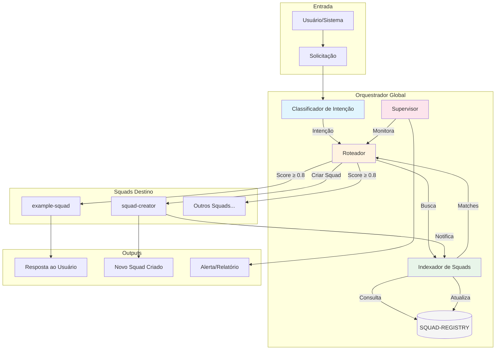
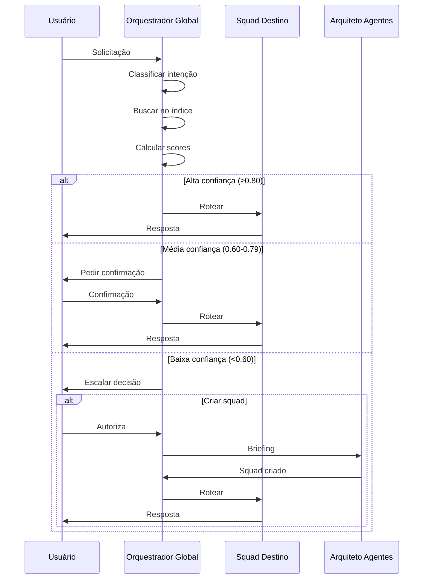

# Squad: Orquestrador Global
## Sistema Nervoso Central do Mega Brain-Core

---

## 📋 Visão Geral

### Propósito
Atuar como o ponto de entrada central para todas as solicitações do sistema, classificando intenções, encontrando o squad/agente mais adequado para cada demanda, e coordenando a criação de novos squads quando necessário.

### Domínio
Orquestração, roteamento e gestão do ecossistema de agentes.

### Problemas que Resolve
- Usuário não sabe qual squad/agente usar para sua necessidade
- Solicitações não chegam ao destino correto
- Falta de visibilidade sobre capacidades disponíveis no sistema
- Demandas recorrentes sem squad adequado não são identificadas
- Criação de squads não é acionada proativamente
- Métricas de uso e gaps não são monitoradas

### Capacidade Especial
🧠 **ORQUESTRAÇÃO_CENTRAL** - Este squad é o único autorizado a rotear solicitações para outros squads e a acionar a criação de novos squads via squad-creator.

---

## 👥 Composição do Squad

| # | Agente | Papel | Prioridade |
|---|--------|-------|------------|
| 1 | [Classificador de Intenção](agents/classificador-intencao.md) | Analisar solicitações e extrair intenção estruturada | P0 |
| 2 | [Indexador de Squads](agents/indexador-squads.md) | Descobrir e manter índice de squads disponíveis | P0 |
| 3 | [Roteador](agents/roteador.md) | Decidir para qual squad/agente rotear | P0 |
| 4 | [Supervisor de Sistema](agents/supervisor-sistema.md) | Monitorar saúde e identificar gaps | P1 |

---

## 🔄 Diagrama de Fluxo

---

## 📊 Workflows Disponíveis

| Workflow | Trigger | Agentes Envolvidos | Output |
|----------|---------|-------------------|--------|
| [Processar Solicitação](workflows/processar-solicitacao.md) | Qualquer solicitação | CI → IDX → R | Solicitação roteada ou escalada |
| [Atualizar Índice](workflows/atualizar-indice.md) | Squad criado/modificado | IDX | SQUAD-REGISTRY atualizado |
| [Auto-Discovery](workflows/auto-discovery.md) | Startup, diário, manual | IDX → SUP | Squads sincronizados |

---

## 🔗 Integrações

| Sistema | Função | Agentes |
|---------|--------|---------|
| Sistema de Arquivos | Leitura de squads | IDX |
| squad-creator | Criação de novos squads | R |
| Todos os squads | Destino de roteamento | R |
| Logs/Métricas | Monitoramento | SUP |

---

## 📚 Base de Conhecimento

| Documento | Descrição |
|-----------|-----------|
| [SQUAD-REGISTRY.md](knowledge/SQUAD-REGISTRY.md) | Índice dinâmico de todos os squads |

---

## 🎯 Algoritmo de Roteamento

### Cálculo de Score de Compatibilidade

| Componente | Peso | Descrição |
|------------|------|-----------|
| Match de Domínio | 40% | Compatibilidade entre domínio da intenção e do squad |
| Match de Problemas | 35% | Quantos problemas do squad são relevantes |
| Match de Tipo de Tarefa | 15% | Agente tem capacidade para o tipo de tarefa |
| Match de Keywords | 10% | Palavras-chave em comum |

### Thresholds de Decisão

| Score | Ação | Descrição |
|-------|------|-----------|
| ≥ 0.80 | Rotear Direto | Alta confiança, sem intervenção humana |
| 0.60-0.79 | Confirmar | Apresentar opções para humano escolher |
| < 0.60 | Escalar | Humano decide: rotear, criar squad, ou rejeitar |

---

## 🔄 Ciclo de Vida de uma Solicitação

---

## ✅ Princípios do Squad

### SEMPRE
1. Classificar toda solicitação antes de rotear
2. Consultar o índice para encontrar matches
3. Respeitar thresholds de confiança
4. Envolver humano quando incerto (score < 0.80)
5. Manter SQUAD-REGISTRY atualizado
6. Registrar todas as decisões de roteamento
7. Monitorar gaps e sugerir novos squads

### NUNCA
1. Rotear sem classificar a intenção
2. Ignorar thresholds de confiança
3. Criar squads automaticamente sem autorização humana
4. Modificar squads existentes (papel do squad-creator)
5. Executar tarefas dos squads destino
6. Tomar decisões de negócio além do roteamento
7. Expor dados sensíveis de usuários

---

## 🔍 Auto-Discovery

### Mecanismo de Sincronização

O squad possui um workflow de **auto-discovery** que garante que o SQUAD-REGISTRY esteja sempre sincronizado com os squads existentes em disco:

| Trigger | Modo | Frequência |
|---------|------|------------|
| Startup do sistema | scan_completo | Cada inicialização |
| Callback do squad-creator | adicionar | Imediato após criação |
| Cron diário | scan_completo | 00:00 |
| Manual (*sync-squads) | scan_completo | Sob demanda |

### Garantias
- **Cobertura 100%**: Todos os squads em disco serão indexados
- **Latência < 5min**: Novos squads descobertos rapidamente
- **Consistência**: Registry sempre reflete estado real do disco
- **Recuperação**: Falhas de notificação são compensadas pelo scan periódico

### Comandos de Sincronização
| Comando | Descrição |
|---------|-----------|
| `*sync-squads` | Forçar sincronização completa |
| `*index-squad {id}` | Indexar squad específico |
| `*validate-registry` | Validar consistência |
| `*refresh-registry` | Reconstruir do zero |

---

## 📈 Métricas do Squad

| Métrica | Alvo | Descrição |
|---------|------|-----------|
| Taxa de roteamento direto | > 80% | Solicitações roteadas sem intervenção |
| Taxa de confirmação | < 15% | Solicitações que precisam confirmação |
| Taxa de escalação | < 5% | Solicitações escaladas para humano |
| Precisão de roteamento | > 90% | Roteamentos corretos (validados) |
| Tempo médio de classificação | < 3s | Latência da classificação |
| Cobertura do índice | 100% | Squads indexados vs existentes |

---

## 🔗 Relação com Outros Squads

### Squad que este orquestra:
- **Todos os squads** - Recebe solicitações roteadas pelo orquestrador

### Squad que invoca este:
- **Nenhum** - Este é o ponto de entrada principal

### Squad com relação especial:
- **squad-creator** - Recebe briefings para criar novos squads quando gaps são identificados

---

## 🏷️ Metadados

| Campo | Valor |
|-------|-------|
| Versão | 1.1.0 |
| Criado em | 2026-02-01 |
| Atualizado em | 2026-02-04 |
| Autor | Mega Brain-Core |
| Status | ✅ Ativo |
| Prioridade | P0 - Crítico |
| Tags | orquestração, roteamento, índice, classificação, infraestrutura |
