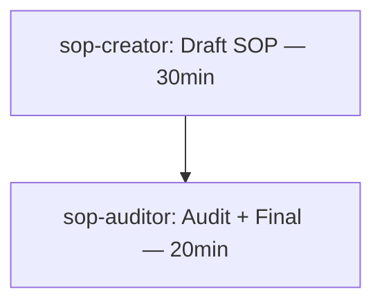

<!-- Consumer: humano (review pre-handoff) — narrative twin de orchestration-plan-tmpl.yaml -->
<!-- Schema version: 2.0 -->

# Plano de Orquestração — `{plan_id}`

> **Demanda:** {demand_raw}
> **Criado:** {created_at} · **Score:** {quality_score}/5 · **Custo estimado:** ${total_cost_usd}

## Resumo Executivo (3 linhas)

1. {linha 1 — o que foi pedido + complexity}
2. {linha 2 — as N capabilities top selecionadas + IDS decisions}
3. {linha 3 — caminho crítico em horas + próxima ação sugerida}

---

## DAG

```mermaid
flowchart TD
    {nó 1 — capability — duração}
    {nó 2 — capability — duração}
    {nó N}
    {edge from→to}
```

---

## Capabilities Selecionadas

| # | Capability | Tipo | Score | IDS | Razão |
|---|---|---|---|---|---|
| 1 | {id} | {type} | {score} | {decision} | {reason} |

---

## Top Riscos

| RPN | Nó | Descrição | Mitigação |
|---|---|---|---|
| {rpn} | {node} | {desc} | {mitigation} |

---

## Critérios de Sucesso (testáveis)

- [ ] {metric} — threshold: {threshold}

---

## Assumptions Falsificáveis

- {assumption — pode ser provada falsa por...}

---

## Handoff

- **Próxima ação sugerida:** `{next_action_suggested}`
- **Executor:** `{next_action_executor}`
- **Aprovações requeridas:** {approvals_required}
- **NÃO executar até:** {do_not_execute_until}

---

## Compliance Constitutional

| Check | Status |
|---|---|
| CODEOWNERS | {codeowners_check} |
| Business Isolation | {business_isolation_check} |
| Agent Authority | {agent_authority_check} |
| No-Invention | {no_invention_check} |

---

## Example

> **Demanda:** "Criar SOP de onboarding cliente novo"
> **Criado:** 2026-04-28T15:00:00Z · **Score:** 4.6/5 · **Custo estimado:** $0.05

### Resumo Executivo

1. SOP simples para sua-empresa (low complexity, single BU, ops domain)
2. REUSE squad `megabrain-sop` + agent `sop-creator` (score 0.91/0.93)
3. Caminho crítico ~50min serial (sop-creator → sop-auditor); próximo: `/swarm-execute megabrain-sop:sop-creator` após aprovação operator

### DAG



### Capabilities

| # | Capability | Tipo | Score | IDS | Razão |
|---|---|---|---|---|---|
| 1 | megabrain-sop | squad | 0.91 | REUSE | Squad especializado em SOP creation |
| 2 | megabrain-sop:sop-creator | agent | 0.93 | REUSE | Entry-point criação direta |

### Top Riscos

| RPN | Nó | Descrição | Mitigação |
|---|---|---|---|
| 12 | n1 | Draft pode faltar contexto específico de sua-empresa | sop-creator lê L0-identity + L1-strategy antes |

### Critérios de Sucesso

- [ ] SOP aprovado por @po (sua-empresa) — pass
- [ ] Onboarding ramp-up time — ≤ 4h até cliente operacional

### Assumptions Falsificáveis

- megabrain-sop squad cobre domain ops (não só compliance)
- Template padrão é adequado para sua-empresa (não precisa custom)

### Handoff

- **Próxima ação:** `/swarm-execute megabrain-sop:sop-creator`
- **Executor:** `@dev`
- **Aprovações:** nenhuma adicional
- **NÃO executar até:** user approval
