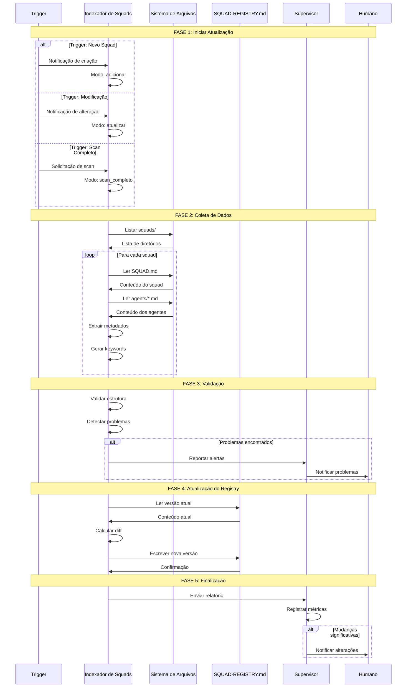

# Workflow: Atualizar Índice
## Manutenção do SQUAD-REGISTRY

---

## 📋 Visão Geral

### Propósito
Manter o SQUAD-REGISTRY.md sempre atualizado com informações precisas sobre todos os squads disponíveis no sistema, garantindo que o roteamento funcione corretamente.

### Triggers
- Novo squad criado pelo arquiteto-agentes
- Squad modificado (agentes adicionados/removidos)
- Solicitação manual de re-scan
- Periodicidade automática (diária)

### Output Esperado
- SQUAD-REGISTRY.md atualizado
- Relatório de alterações
- Alertas sobre inconsistências

---

## 🔄 Diagrama de Fluxo



---

## 📊 Etapas Detalhadas

### Etapa 1: Determinar Modo de Operação
| Campo | Valor |
|-------|-------|
| **Agente Responsável** | Indexador de Squads |
| **Input** | Trigger de atualização |
| **Output** | Modo de operação definido |

**Modos disponíveis:**

| Modo | Trigger | Escopo |
|------|---------|--------|
| `adicionar` | Novo squad criado | Apenas o novo squad |
| `atualizar` | Squad modificado | Apenas o squad alterado |
| `scan_completo` | Manual ou periódico | Todos os squads |
| `refinar` | Feedback de roteamento | Keywords específicas |

---

### Etapa 2: Escanear Sistema de Arquivos
| Campo | Valor |
|-------|-------|
| **Agente Responsável** | Indexador de Squads |
| **Input** | Modo de operação |
| **Output** | Lista de squads encontrados |
| **Critério de Sucesso** | Diretórios acessíveis |

**Ações:**
1. Acessar diretório `squads/`
2. Listar todos os subdiretórios
3. Filtrar apenas diretórios com SQUAD.md
4. Retornar lista de squad_ids

**Estrutura esperada:**
```
squads/
├── example-squad/
│   ├── SQUAD.md          ← Obrigatório
│   ├── agents/           ← Obrigatório
│   │   ├── agente-1.md
│   │   └── agente-2.md
│   └── workflows/        ← Opcional
├── arquiteto-agentes/
│   └── ...
└── orquestrador-global/
    └── ...
```

---

### Etapa 3: Extrair Metadados dos Squads
| Campo | Valor |
|-------|-------|
| **Agente Responsável** | Indexador de Squads |
| **Input** | Squad_id para processar |
| **Output** | Metadados estruturados |
| **Critério de Sucesso** | Dados completos extraídos |

**Para cada squad, extrair:**

| Campo | Fonte | Seção no SQUAD.md |
|-------|-------|-------------------|
| id | Nome do diretório | - |
| dominio | SQUAD.md | Visão Geral > Domínio |
| proposito | SQUAD.md | Visão Geral > Propósito |
| problemas | SQUAD.md | Visão Geral > Problemas que Resolve |
| agentes | agents/*.md | Lista de arquivos |
| workflows | workflows/*.md | Lista de arquivos |
| integracoes | SQUAD.md | Integrações |
| status | SQUAD.md | Metadados > Status |

**Para cada agente do squad, extrair:**

| Campo | Fonte | Seção no agente.md |
|-------|-------|-------------------|
| nome | agente.md | Identidade > Nome |
| papel | agente.md | Identidade > Papel |
| capacidades | agente.md | Actions (lista de triggers) |
| tags | agente.md | Metadados > Tags |

---

### Etapa 4: Gerar Keywords
| Campo | Valor |
|-------|-------|
| **Agente Responsável** | Indexador de Squads |
| **Input** | Metadados do squad |
| **Output** | Lista de keywords |
| **Critério de Sucesso** | Keywords relevantes e únicas |

**Fontes de keywords:**

| Fonte | Exemplo | Peso |
|-------|---------|------|
| Domínio | "um nicho de saúde" → massagem, terapia | Alto |
| Problemas | "criar conteúdo" → content, posts | Alto |
| Nomes de agentes | "copywriter" → copy, texto | Médio |
| Actions | "criar headlines" → headline, título | Médio |
| Integrações | "Instagram" → insta, social | Baixo |
| Tags dos agentes | Incluir diretamente | Baixo |

**Regras de geração:**
1. Incluir variações (singular/plural)
2. Incluir sinônimos comuns
3. Incluir português e inglês quando relevante
4. Remover stopwords (de, para, o, a...)
5. Máximo 50 keywords por squad
6. Ordenar por relevância

---

### Etapa 5: Validar Consistência
| Campo | Valor |
|-------|-------|
| **Agente Responsável** | Indexador de Squads |
| **Input** | Dados coletados |
| **Output** | Relatório de validação |
| **Critério de Sucesso** | Sem erros críticos |

**Validações:**

| Validação | Severidade | Ação se falhar |
|-----------|------------|----------------|
| SQUAD.md existe | Crítica | Ignorar squad |
| Pelo menos 1 agente | Crítica | Alertar |
| ID único | Crítica | Alertar conflito |
| Campos obrigatórios | Alta | Alertar |
| Agentes têm 12 seções | Média | Alertar |
| Keywords não vazias | Baixa | Gerar automaticamente |

**Output de validação:**
```yaml
validacao:
  squad: "nome-do-squad"
  status: "valido" | "alertas" | "invalido"
  erros: []
  alertas:
    - tipo: "agente_incompleto"
      arquivo: "agente-x.md"
      detalhe: "Faltam seções: Dependências, Restrições"
```

---

### Etapa 6: Calcular Diff
| Campo | Valor |
|-------|-------|
| **Agente Responsável** | Indexador de Squads |
| **Input** | Dados novos + Registry atual |
| **Output** | Lista de mudanças |
| **Critério de Sucesso** | Diff preciso calculado |

**Tipos de mudança:**

| Tipo | Descrição |
|------|-----------|
| `squad_adicionado` | Novo squad no sistema |
| `squad_removido` | Squad não existe mais |
| `agente_adicionado` | Novo agente em squad existente |
| `agente_removido` | Agente removido de squad |
| `metadados_alterados` | Mudança em domínio, problemas, etc. |
| `keywords_atualizadas` | Lista de keywords modificada |

**Output de diff:**
```yaml
diff:
  timestamp: "2026-02-01T18:00:00Z"
  squads_adicionados: 1
  squads_removidos: 0
  squads_modificados: 1
  mudancas:
    - tipo: "squad_adicionado"
      squad: "ecommerce-ops"
      detalhes: {metadados completos}
    - tipo: "agente_adicionado"
      squad: "example-squad"
      agente: "novo-agente"
```

---

### Etapa 7: Atualizar SQUAD-REGISTRY.md
| Campo | Valor |
|-------|-------|
| **Agente Responsável** | Indexador de Squads |
| **Input** | Dados validados + Diff |
| **Output** | Registry atualizado |
| **Critério de Sucesso** | Arquivo salvo com sucesso |

**Estrutura do SQUAD-REGISTRY.md:**

```markdown
# SQUAD Registry
## Índice Centralizado de Squads do Mega Brain-Core

---

## 📊 Visão Geral

| Métrica | Valor |
|---------|-------|
| Total de Squads | X |
| Total de Agentes | Y |
| Última Atualização | timestamp |
| Atualizado por | Indexador de Squads |

---

## 🗂️ Squads Registrados

### squad-id

| Campo | Valor |
|-------|-------|
| **ID** | squad-id |
| **Status** | ✅ Ativo |
| **Domínio** | Descrição |
| **Localização** | `squads/squad-id/` |

**Problemas que Resolve:**
- Problema 1
- Problema 2

**Agentes (N):**
| Agente | Papel | Capacidades |
|--------|-------|-------------|

**Workflows:**
| Workflow | Trigger | Output |

**Keywords:**
`keyword1`, `keyword2`, `keyword3`

---

## 🔍 Índice de Capacidades

### Por Tipo de Tarefa
| Tipo | Squads | Agentes |

### Por Domínio
| Domínio | Squad |

---

## 📈 Estatísticas

### Cobertura de Domínios
| Domínio | Status |

### Capacidades Especiais
| Capacidade | Squad | Descrição |
```

---

### Etapa 8: Gerar Relatório
| Campo | Valor |
|-------|-------|
| **Agente Responsável** | Indexador de Squads |
| **Input** | Diff + Validações |
| **Output** | Relatório de atualização |
| **Critério de Sucesso** | Relatório completo |

**Relatório de atualização:**
```yaml
relatorio:
  timestamp: "2026-02-01T18:00:00Z"
  modo: "scan_completo"
  duracao: "2.3s"
  resultados:
    squads_encontrados: 3
    squads_validos: 3
    squads_com_alertas: 1
    agentes_total: 16
  mudancas:
    adicionados: 1
    removidos: 0
    modificados: 1
  alertas:
    - {squad: "x", tipo: "y", mensagem: "z"}
  status: "sucesso"
```

---

### Etapa 9: Notificar Partes Interessadas
| Campo | Valor |
|-------|-------|
| **Agente Responsável** | Supervisor de Sistema |
| **Input** | Relatório de atualização |
| **Output** | Notificações enviadas |
| **Critério de Sucesso** | Partes relevantes notificadas |

**Critérios para notificação:**

| Situação | Notificar |
|----------|-----------|
| Novo squad criado | Sempre |
| Squad removido | Sempre |
| Erros críticos | Sempre |
| Alertas acumulados (>3) | Sim |
| Scan completo sem mudanças | Não |

---

## 🚨 Tratamento de Erros

| Erro | Causa | Ação |
|------|-------|------|
| Diretório inacessível | Permissões | Log de erro, continuar |
| SQUAD.md inválido | Formato incorreto | Alertar, ignorar squad |
| Conflito de ID | Duplicação | Alertar, usar primeiro |
| Falha ao salvar | Disco cheio/permissão | Erro crítico, notificar |
| Timeout no scan | Muitos arquivos | Dividir em lotes |

---

## ⏱️ Periodicidade

| Trigger | Frequência | Modo |
|---------|------------|------|
| Automático | Diário (00:00) | scan_completo |
| Pós-criação de squad | Imediato | adicionar |
| Pós-modificação | Imediato | atualizar |
| Manual | Sob demanda | scan_completo |
| Feedback negativo | Sob demanda | refinar |

---

## 📈 Métricas Coletadas

| Métrica | Descrição | Uso |
|---------|-----------|-----|
| Tempo de scan | Duração total | Performance |
| Squads processados | Quantidade | Volume |
| Taxa de erro | % com problemas | Qualidade |
| Keywords geradas | Total por squad | Cobertura |
| Mudanças detectadas | Por tipo | Evolução |

---

## 📝 Exemplo Completo

### Cenário: Novo squad criado

**Trigger:**
```yaml
trigger:
  tipo: "squad_criado"
  squad_id: "ecommerce-ops"
  origem: "arquiteto-agentes"
```

**Execução:**

1. **Modo definido:** `adicionar`

2. **Scan do novo squad:**
```yaml
squad:
  id: "ecommerce-ops"
  dominio: "Operações de e-commerce"
  problemas:
    - "Gestão de pedidos"
    - "Controle de estoque"
  agentes:
    - nome: "order-manager"
      papel: "Gerenciar pedidos"
    - nome: "inventory-controller"
      papel: "Controlar estoque"
```

3. **Keywords geradas:**
```
ecommerce, loja, virtual, pedido, estoque, shopify,
ordem, inventário, produto, venda, frete
```

4. **Validação:**
```yaml
validacao:
  status: "valido"
  erros: []
  alertas: []
```

5. **Diff calculado:**
```yaml
diff:
  squads_adicionados: 1
  mudancas:
    - tipo: "squad_adicionado"
      squad: "ecommerce-ops"
```

6. **Registry atualizado:**
- Nova seção "ecommerce-ops" adicionada
- Índices de capacidades atualizados
- Timestamp atualizado

7. **Relatório:**
```markdown
## Atualização do Registry

✅ Squad "ecommerce-ops" adicionado com sucesso
- 2 agentes indexados
- 11 keywords geradas
- Sem alertas
```

---

## 🏷️ Metadados

| Campo | Valor |
|-------|-------|
| Versão | 1.0.0 |
| Criado em | 2026-02-01 |
| Atualizado em | 2026-02-01 |
| Autor | Mega Brain-Core |
| Squad | orquestrador-global |
| Tipo | Workflow de Manutenção |
| Prioridade | P0 |

## MEGABRAIN Deep Validation

- Last run: `20260514-validate-deep`
- Validator: `mega-brain/megabrain-chief`
- Mode: `deep`
- Workflow ID: `atualizar-indice`
- Status: `pass`
- External execution: not performed during structural validation.
