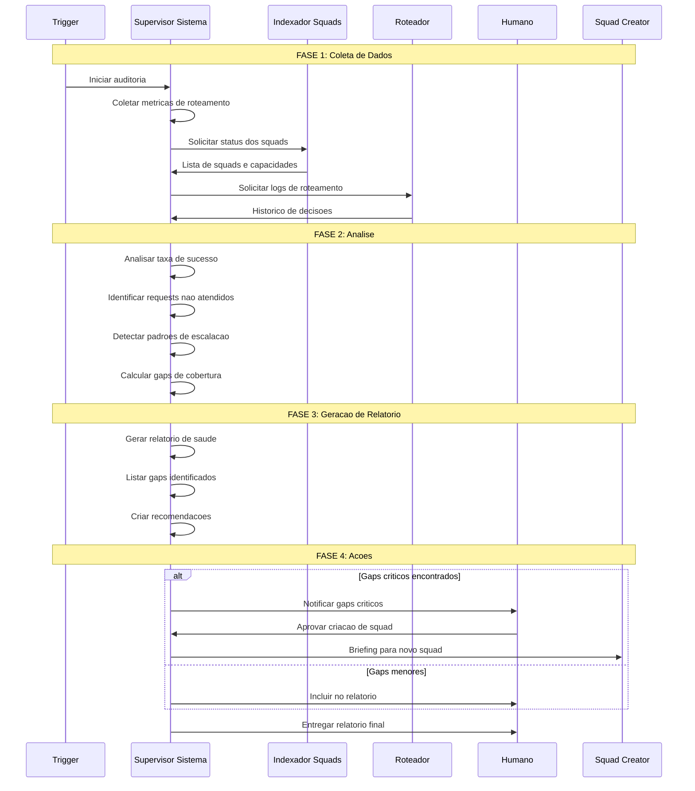

# Workflow: Auditoria de Sistema
## Monitoramento e Avaliacao de Saude do Ecossistema Mega Brain

---

## Visao Geral

### Proposito
Analisar a saude do ecossistema Mega Brain-Core, identificar gaps de cobertura, monitorar metricas de roteamento e gerar recomendacoes para evolucao do sistema.

### Trigger
- Manual: Comando `*audit`
- Agendado: Semanal (configuravel)
- Automatico: Quando `unmatched_requests > 20%`

### Output Esperado
- Relatorio de saude do sistema
- Lista de gaps identificados
- Recomendacoes de novos squads
- Metricas de performance

---

## Diagrama de Fluxo



---

## Etapas Detalhadas

### Etapa 1: Coleta de Metricas
| Campo | Valor |
|-------|-------|
| **Agente Responsavel** | Supervisor de Sistema |
| **Input** | Trigger de auditoria |
| **Output** | Dados brutos coletados |
| **Timeout** | 30 segundos |

**Acoes:**
1. Coletar metricas de roteamento dos ultimos 30 dias
2. Obter lista de todos os squads ativos
3. Buscar logs de decisoes do Roteador
4. Identificar requests escalados ou nao atendidos

**Dados Coletados:**
```yaml
coleta:
  periodo: "ultimos 30 dias"
  metricas:
    - total_requests
    - requests_por_squad
    - routing_accuracy
    - escalation_rate
    - unmatched_requests
    - avg_routing_latency
  squads:
    - lista_ativos
    - status_cada_squad
    - capacidades_declaradas
  logs:
    - decisoes_roteamento
    - escalacoes
    - criacoes_squad
```

---

### Etapa 2: Analise de Saude
| Campo | Valor |
|-------|-------|
| **Agente Responsavel** | Supervisor de Sistema |
| **Input** | Dados coletados |
| **Output** | Diagnostico de saude |
| **Criterio de Sucesso** | Todas as metricas analisadas |

**Acoes:**
1. Calcular KPIs de performance
2. Comparar com thresholds definidos
3. Identificar tendencias (melhorando/piorando)
4. Detectar anomalias

**KPIs Analisados:**
```yaml
kpis:
  routing_accuracy:
    atual: "X%"
    threshold: ">= 90%"
    status: "OK|WARNING|CRITICAL"

  escalation_rate:
    atual: "X%"
    threshold: "<= 10%"
    status: "OK|WARNING|CRITICAL"

  unmatched_rate:
    atual: "X%"
    threshold: "<= 5%"
    status: "OK|WARNING|CRITICAL"

  avg_latency:
    atual: "Xms"
    threshold: "<= 2000ms"
    status: "OK|WARNING|CRITICAL"
```

---

### Etapa 3: Identificacao de Gaps
| Campo | Valor |
|-------|-------|
| **Agente Responsavel** | Supervisor de Sistema |
| **Input** | Diagnostico + Logs |
| **Output** | Lista de gaps |
| **Criterio de Sucesso** | Gaps categorizados e priorizados |

**Acoes:**
1. Agrupar requests nao atendidos por dominio
2. Identificar padroes recorrentes
3. Calcular frequencia e impacto
4. Priorizar gaps por criticidade

**Categorias de Gap:**
```yaml
gaps:
  - tipo: "dominio_ausente"
    descricao: "Nenhum squad cobre o dominio"
    exemplo: "Nao ha squad para juridico"
    prioridade: "P0|P1|P2"
    frequencia: "X requests/semana"

  - tipo: "capacidade_insuficiente"
    descricao: "Squad existe mas nao tem capacidade especifica"
    exemplo: "Squad marketing nao faz SEO tecnico"
    prioridade: "P0|P1|P2"
    frequencia: "X requests/semana"

  - tipo: "performance_baixa"
    descricao: "Squad existe mas com baixa performance"
    exemplo: "Squad X com accuracy < 70%"
    prioridade: "P0|P1|P2"
    impacto: "X requests afetados"
```

---

### Etapa 4: Geracao de Recomendacoes
| Campo | Valor |
|-------|-------|
| **Agente Responsavel** | Supervisor de Sistema |
| **Input** | Gaps identificados |
| **Output** | Lista de recomendacoes |
| **Criterio de Sucesso** | Cada gap tem recomendacao |

**Tipos de Recomendacao:**
```yaml
recomendacoes:
  criar_squad:
    aplicavel_quando: "dominio_ausente com frequencia >= 5/semana"
    acao: "Criar novo squad para cobrir dominio"
    inclui: "Briefing inicial para squad-creator"

  expandir_squad:
    aplicavel_quando: "capacidade_insuficiente"
    acao: "Adicionar agente ou capacidade ao squad existente"
    inclui: "Sugestao de nova capacidade"

  otimizar_squad:
    aplicavel_quando: "performance_baixa"
    acao: "Revisar e otimizar squad existente"
    inclui: "Pontos de melhoria identificados"

  melhorar_roteamento:
    aplicavel_quando: "accuracy baixo mas squads adequados"
    acao: "Ajustar algoritmo ou thresholds de roteamento"
    inclui: "Parametros sugeridos"
```

---

### Etapa 5: Geracao de Relatorio
| Campo | Valor |
|-------|-------|
| **Agente Responsavel** | Supervisor de Sistema |
| **Input** | Todas as analises |
| **Output** | Relatorio estruturado |
| **Template** | system-health-report-tmpl |

**Estrutura do Relatorio:**
```yaml
relatorio:
  metadata:
    data: "YYYY-MM-DD"
    periodo_analise: "DD/MM a DD/MM"
    gerado_por: "supervisor-sistema"

  executive_summary:
    status_geral: "HEALTHY|WARNING|CRITICAL"
    principais_achados: [...]
    acoes_urgentes: [...]

  metricas:
    tabela_kpis: [...]
    graficos_tendencia: [...]
    comparativo_periodo_anterior: [...]

  gaps:
    total_identificados: X
    por_prioridade:
      P0: X
      P1: X
      P2: X
    detalhamento: [...]

  recomendacoes:
    criar_squads: [...]
    expandir_squads: [...]
    otimizar_squads: [...]
    ajustar_roteamento: [...]

  proximas_acoes:
    imediatas: [...]
    curto_prazo: [...]
    medio_prazo: [...]
```

---

### Etapa 6: Notificacao e Acoes
| Campo | Valor |
|-------|-------|
| **Agente Responsavel** | Supervisor de Sistema |
| **Input** | Relatorio + Gaps criticos |
| **Output** | Notificacoes enviadas |
| **Criterio de Sucesso** | Stakeholders notificados |

**Acoes:**
1. SE gaps P0 encontrados:
   - Notificar humano imediatamente
   - Preparar briefing para squad-creator
   - Aguardar aprovacao para criacao
2. SE gaps P1 encontrados:
   - Incluir no relatorio com destaque
   - Agendar revisao
3. Entregar relatorio ao solicitante
4. Arquivar para historico

---

## Checkpoints e Pausas

| Checkpoint | Fase | Condicao | Acao |
|------------|------|---------|------|
| **CP-1: Validacao de Coleta** | Etapa 1 | Metricas coletadas com sucesso | Continuar para Etapa 2 |
| **CP-2: Validacao de Dados** | Etapa 2 | Dados suficientes para analise | Continuar para Etapa 3 |
| **CP-3: Validacao de Gaps** | Etapa 3 | Gaps categorizados e priorizados | Continuar para Etapa 4 |
| **CP-4: Validacao de Recomendacoes** | Etapa 4 | Cada gap tem recomendacao | Continuar para Etapa 5 |
| **CP-5: Validacao de Relatorio** | Etapa 5 | Relatorio estruturado completo | Continuar para Etapa 6 |
| **CP-6: Gate de Criacao** | Etapa 6 | SE gaps P0 encontrados | Aguardar aprovacao do usuario |

---

## Quality Gates Entre Fases

### Gate 1: Apos Coleta de Metricas

| Criterio | Obrigatorio | Validacao |
|----------|-----------|-----------|
| Todas as metricas disponíveis | SIM | Verificar se dataset >= 80% completo |
| Sem erros de coleta | SIM | Logs de erro vazios |
| Timestamp válido | SIM | Horario dentro dos ultimos 30 dias |
| **Decisao** | **APROVADO** | **Prosseguir para Analise** |

### Gate 2: Apos Analise de Saude

| Criterio | Obrigatorio | Validacao |
|----------|-----------|-----------|
| Todos os KPIs calculados | SIM | Routing_accuracy, Escalation, Unmatched, Latency |
| Comparacao com thresholds completa | SIM | Status (OK/WARNING/CRITICAL) atribuido |
| Tendencias identificadas | NAO | Desejavel mas nao bloqueador |
| **Decisao** | **APROVADO** | **Prosseguir para Identificacao de Gaps** |

### Gate 3: Apos Identificacao de Gaps

| Criterio | Obrigatorio | Validacao |
|----------|-----------|-----------|
| Gaps categorizados | SIM | Cada gap tem tipo (dominio_ausente, capacidade, performance) |
| Gaps priorizados | SIM | Cada gap tem P0/P1/P2 |
| Frequencia calculada | SIM | Numero de requests/semana |
| **Decisao** | **APROVADO** | **Prosseguir para Recomendacoes** |

### Gate 4: Apos Geracao de Recomendacoes

| Criterio | Obrigatorio | Validacao |
|----------|-----------|-----------|
| 100% dos gaps tem recomendacao | SIM | Nenhum gap sem acao |
| Recomendacoes sao acionaveis | SIM | Cada recomendacao clara e implementavel |
| Briefing pronto (se criar_squad) | SIM | Briefing para squad-creator disponível |
| **Decisao** | **APROVADO** | **Prosseguir para Relatorio** |

### Gate 5: Apos Geracao de Relatorio

| Criterio | Obrigatorio | Validacao |
|----------|-----------|-----------|
| Metadata completa | SIM | Data, periodo, gerado_por preenchidos |
| Executive summary presente | SIM | Status geral + principais achados |
| Metricas e graficos | SIM | Tabela KPIs, comparativos |
| Gaps detalhados | SIM | Cada gap com descricao e impacto |
| Recomendacoes acionaveis | SIM | Listas de criar/expandir/otimizar/ajustar |
| **Decisao** | **APROVADO** | **Prosseguir para Notificacao** |

### Gate 6: Decisao sobre Criacao de Squad

| Condicao | Decisao | Proxima Acao |
|----------|---------|-------------|
| P0 gaps encontrados | BLOQUEADOR | Notificar usuario, aguardar aprovacao |
| Apenas P1/P2 gaps | NAO-BLOQUEADOR | Incluir no relatorio, continuar notificacao |
| Nenhum gap encontrado | SUCESSO | Relatorio limpo, arquivar |

---

## Decision Trees

### Arvore 1: Quando Iniciar Auditoria?

```
Trigger Recebido?
├─ Comando *audit (manual)
│  └─> Iniciar imediatamente
├─ Agendado (semanal)
│  └─> Iniciar em horario configurado
└─ Automatico (unmatched > 20%)
   ├─ unmatched_rate > 20% ?
   │  └─ SIM: Iniciar auditoria
   │  └─ NAO: Aguardar proximo ciclo
```

### Arvore 2: Qual Tipo de Recomendacao?

```
Gap Identificado?
├─ Tipo: dominio_ausente
│  ├─ frequencia >= 5/semana ?
│  │  └─ SIM: criar_squad (P0/P1)
│  │  └─ NAO: monitorar (P2)
│  └─ Criar briefing para squad-creator
│
├─ Tipo: capacidade_insuficiente
│  ├─ Expandir squad existente ?
│  │  └─ SIM: Identificar capacidade a adicionar
│  │  └─ NAO: Monitorar
│  └─ Sugerir novo agente ou skill
│
└─ Tipo: performance_baixa
   ├─ Squad pode ser otimizado ?
   │  └─ SIM: otimizar_squad (revisar config)
   │  └─ NAO: Substituir squad (raro)
   └─ Listar pontos de melhoria
```

### Arvore 3: Notificacao ao Usuario

```
Relatorio Pronto?
├─ Gaps P0 encontrados ?
│  └─ SIM:
│     ├─ Notificar usuario IMEDIATAMENTE
│     ├─ Incluir briefing para criar squad
│     ├─ Aguardar APROVACAO usuario
│     └─ Criar ClickUp task se aprovado
│
├─ Gaps P1 encontrados ?
│  └─ SIM:
│     ├─ Incluir no relatorio com destaque
│     ├─ Agendar revisao em 1 semana
│     └─ Monitorar proximo ciclo
│
└─ Apenas P2 / Nenhum gap ?
   └─ Entregar relatorio normal
      └─ Arquivar para historico
```

---

## Risk e Mitigacao por Fase

### Fase 1: Coleta de Metricas

| Risk | Probabilidade | Impacto | Mitigacao |
|------|--------------|---------|-----------|
| Dados parciais ou incompletos | MEDIA | ALTO | Usar dados >= 80% disponíveis, log aviso |
| Timeout na coleta | BAIXA | ALTO | Timeout de 30s, fallback para dados em cache |
| Inconsistencia entre fontes | MEDIA | MEDIO | Validar multiplas fontes, agrupar por timestamp |
| Squad removido durante coleta | BAIXA | BAIXO | Validar lista antes de processar, skip deletados |

### Fase 2: Analise de Saude

| Risk | Probabilidade | Impacto | Mitigacao |
|------|--------------|---------|-----------|
| Threshold desatualizado | MEDIA | MEDIO | Revisar thresholds mensalmente, versionados |
| KPI nao disponível | BAIXA | MEDIO | Marcar como "N/A", continuar com outros |
| Anomalia detectada incorretamente | MEDIA | BAJO | Validacao manual de anomalias P0 |
| Tendencia invertida entre periodos | BAIXA | BAJO | Confirmar com dados brutos antes de relatar |

### Fase 3: Identificacao de Gaps

| Risk | Probabilidade | Impacto | Mitigacao |
|------|--------------|---------|-----------|
| Gap nao detectado | MEDIA | ALTO | Revisar logs de escalacao, requests rejeitados |
| Gap categorizado incorretamente | MEDIA | MEDIO | Validacao manual de P0 gaps |
| Frequencia subestimada | BAIXA | MEDIO | Recoleta de dados se houver duvida |
| Impacto mal calculado | BAIXA | BAJO | Usar multiplas metricas (requests, revenue, user impact) |

### Fase 4: Geracao de Recomendacoes

| Risk | Probabilidade | Impacto | Mitigacao |
|------|--------------|---------|-----------|
| Recomendacao nao acionavel | MEDIA | MEDIO | Revisar com humano antes de entregar |
| Custo estimado errado | BAIXA | BAJO | Consultar squad-creator sobre recursos |
| Solucao proposta nao resolve gap | BAIXA | ALTO | Validacao com especialista de dominio |
| Conflito entre recomendacoes | BAIXA | MEDIO | Priorizar por impacto e factibilidade |

### Fase 5: Geracao de Relatorio

| Risk | Probabilidade | Impacto | Mitigacao |
|------|--------------|---------|-----------|
| Relatorio incompleto | BAIXA | MEDIO | Checklist antes de entregar |
| Dados desatualizado no relatorio | BAIXA | BAJO | Timestamp de geracao, validade de dados |
| Relatoro nao legível | BAIXA | BAJO | Template estruturado, validacao HTML/YAML |
| Acesso restrito a relatorio | MUITO-BAIXA | BAJO | Armazenar em repositorio interno |

### Fase 6: Notificacao e Acoes

| Risk | Probabilidade | Impacto | Mitigacao |
|------|--------------|---------|-----------|
| Usuario nao aprova criacao de squad | MEDIA | MEDIO | Justificar bem no briefing, agendar discussao |
| Squad-creator nao consegue criar squad | BAIXA | ALTO | Ter squad de fallback ou expandir existente |
| Notificacao nao chega ao usuario | MUITO-BAIXA | ALTO | Multiplos canais (email, Slack, WhatsApp) |
| Atraso na criacao de squad | MEDIA | MEDIO | Deadline claro no briefing, acompanhamento |

---

## Handoff Descriptions

### Handoff 1: Supervisor → Analista de Dados (Etapa 1)

**Quem envia:** Supervisor de Sistema
**Quem recebe:** Indexador de Squads
**O que envia:** Request de coleta
**Inclui:**
- Data de inicio e fim do periodo
- Lista de metricas desejadas
- Timeout permitido
- Prioridade (URGENT/NORMAL)

**Validacao:**
- [ ] Periodo definido
- [ ] Metricas claras
- [ ] Tempo suficiente para coleta

---

### Handoff 2: Dados Brutos → Analista (Etapa 2)

**Quem envia:** Supervisor de Sistema (fase 1)
**Quem recebe:** Supervisor de Sistema (fase 2)
**O que envia:** Dados coletados em YAML
**Inclui:**
- Metricas brutas
- Logs de decisoes
- Status de cada squad
- Timestamp de coleta

**Validacao:**
- [ ] Dados >= 80% completos
- [ ] Nenhum erro de parse
- [ ] Timestamp valid

---

### Handoff 3: Analise → Identificador de Gaps (Etapa 3)

**Quem envia:** Supervisor de Sistema (fase 2)
**Quem recebe:** Supervisor de Sistema (fase 3)
**O que envia:** Diagnostico de saude com KPIs
**Inclui:**
- Status de cada KPI (OK/WARNING/CRITICAL)
- Tendencias
- Anomalias detectadas
- Comparativo com periodo anterior

**Validacao:**
- [ ] Todos os KPIs calculados
- [ ] Status atribuidos
- [ ] Tendencias documentadas

---

### Handoff 4: Gaps → Gerador de Recomendacoes (Etapa 4)

**Quem envia:** Supervisor de Sistema (fase 3)
**Quem recebe:** Supervisor de Sistema (fase 4)
**O que envia:** Lista de gaps categorizados e priorizados
**Inclui:**
- Tipo de gap
- Prioridade (P0/P1/P2)
- Frequencia
- Impacto estimado
- Exemplos de requests nao atendidos

**Validacao:**
- [ ] Gaps categorizados
- [ ] Priorizados
- [ ] Frequencia calculada

---

### Handoff 5: Recomendacoes → Gerador de Relatorio (Etapa 5)

**Quem envia:** Supervisor de Sistema (fase 4)
**Quem recebe:** Supervisor de Sistema (fase 5)
**O que envia:** Lista de recomendacoes acionaveis
**Inclui:**
- Tipo de recomendacao
- Gap que resolve
- Acao sugerida
- Prioridade
- Briefing (se criar_squad)

**Validacao:**
- [ ] Todas as recomendacoes acionaveis
- [ ] Briefing pronto para P0
- [ ] Estimativa de esforco

---

### Handoff 6: Relatorio → Usuario/Orquestrador (Etapa 6)

**Quem envia:** Supervisor de Sistema (fase 5)
**Quem recebe:** Humano / Orquestrador
**O que envia:** Relatorio estruturado + ClickUp task (se P0)
**Inclui:**
- PDF ou HTML do relatorio
- Links para briefings (se criar_squad)
- ClickUp task ID (se criado)
- Resumo executivo
- Proximas acoes recomendadas

**Validacao:**
- [ ] Relatorio legível
- [ ] Links funcionando
- [ ] ClickUp task criada (se necessario)

---

## Rollback Procedures

### Cenario 1: Coleta Falhou (Etapa 1)

**Condicao:** Timeout ou erro durante coleta de metricas

**Acao:**
1. Log do erro no supervisor
2. Usar dados em cache (auditoria anterior)
3. Marcar relatorio com aviso "DADOS PARCIAIS"
4. Agendar retry da coleta para proxima janela
5. Notificar usuario se dados muito desatualizados (> 7 dias)

**Saida:** Auditoria continua com dados em cache, relatorio marcado

---

### Cenario 2: Analise Inconsistente (Etapa 2)

**Condicao:** KPIs calculados incorretamente ou thresholds desatualizados

**Acao:**
1. Log do erro / threshold desatualizado
2. Voltar para dados brutos, recalcular
3. Comparar com auditoria anterior para validacao
4. Se discrepancia > 20%, solicitar revisao humana
5. Atualizar thresholds se necessario

**Saida:** KPIs recalculados, relatorio atualizado

---

### Cenario 3: Gaps Nao Detectados (Etapa 3)

**Condicao:** Descoberta posterior de gap nao identificado na auditoria

**Acao:**
1. Adicionar gap a backlog de gaps
2. Calcular frequencia retroativamente (se dados disponiveis)
3. Incluir no proximo relatorio ou em atualizacao interim
4. Analisar por que foi missed (gap no algoritmo?)
5. Revisar e-box de classificacao

**Saida:** Gap adicionado, algoritmo potencialmente melhorado

---

### Cenario 4: Squad Rejeitou Recomendacao (Etapa 4)

**Condicao:** Squad-creator ou outro squad rejeitou recomendacao

**Acao:**
1. Documentar feedback da rejeicao
2. Revisar recomendacao com feedback
3. Propor alternativa ou escalar para decisao humana
4. Arquivar recomendacao com motivo da rejeicao
5. Monitorar gap neste ciclo: se persistir, revisitar

**Saida:** Recomendacao revisada ou escalada

---

### Cenario 5: Relatorio Nao Entregue (Etapa 5-6)

**Condicao:** Relatorio gerado mas nao entregue ao usuario

**Acao:**
1. Retry automático 3 vezes com backoff exponencial
2. Se falhar, logar como "FAILED_DELIVERY"
3. Notificar orquestrador que relatorio aguarda entrega
4. Usuário pode solicitar retransmissao manual
5. Manter relatorio em cache por 30 dias

**Saida:** Tentativas de re-entrega, usuario notificado

---

## Success Criteria por Fase

### Fase 1: Coleta de Metricas

| Criterio | Metrica | Sucesso |
|----------|---------|---------|
| Dados coletados | Completude | >= 80% das metricas disponíveis |
| Sem erros | Taxa de erro | <= 5% de falhas |
| Tempo de coleta | Latencia | <= 30 segundos |
| Dados validos | Validacao | Todos os valores dentro de ranges esperados |

### Fase 2: Analise de Saude

| Criterio | Metrica | Sucesso |
|----------|---------|---------|
| KPIs calculados | Completude | 100% dos KPIs (4/4) calculados |
| Thresholds aplicados | Validacao | Cada KPI tem status OK/WARNING/CRITICAL |
| Tendencias identific | Qualidade | Comparacao com periodo anterior feita |
| Anomalias detectadas | Qualidade | Ao menos 1 anomalia validada manualmente |

### Fase 3: Identificacao de Gaps

| Criterio | Metrica | Sucesso |
|----------|---------|---------|
| Gaps categorizados | Completude | 100% dos gaps tem tipo |
| Gaps priorizados | Validacao | Cada gap tem P0/P1/P2 |
| Frequencia calculada | Qualidade | Cada gap tem requests/semana |
| Impacto estimado | Qualidade | Cada gap P0/P1 tem impacto |

### Fase 4: Geracao de Recomendacoes

| Criterio | Metrica | Sucesso |
|----------|---------|---------|
| Cobertura | Completude | 100% dos gaps tem recomendacao |
| Acionabilidade | Qualidade | Cada recomendacao clara e implementavel |
| Briefing pronto | Validacao | SE criar_squad, briefing disponivel |
| Nenhum gap duplicado | Qualidade | Cada recomendacao unica |

### Fase 5: Geracao de Relatorio

| Criterio | Metrica | Sucesso |
|----------|---------|---------|
| Estrutura completa | Validacao | Todas as secoes presentes |
| Legibilidade | Qualidade | Relatorio em formato valido (YAML/HTML) |
| Dados atualizados | Validade | Relatorio gerado < 1 hora atras |
| Assinatura | Audit | Timestamp, autor, versao presentes |

### Fase 6: Notificacao e Acoes

| Criterio | Metrica | Sucesso |
|----------|---------|---------|
| Usuario notificado | Entrega | Relatorio chega ao usuario |
| Aprovacao obtida | Decisao | SE P0 gaps, aprovacao documentada |
| ClickUp task criada | Rastreamento | SE aprovado, task em ClickUp |
| Historico arquivado | Audit | Relatorio salvo para posterior referencia |

---

## Cost e Time Estimates

### Por Fase

| Fase | Tempo Estimado | Recursos | Custo (Tokens) |
|------|----------------|----------|----------------|
| 1 - Coleta | 30s | Supervisor | 500-1000 |
| 2 - Analise | 60s | Supervisor | 2000-3000 |
| 3 - Gaps | 60s | Supervisor | 2000-3000 |
| 4 - Recomendacoes | 60s | Supervisor | 2000-3000 |
| 5 - Relatorio | 30s | Supervisor | 1000-1500 |
| 6 - Notificacao | 10s | Supervisor | 500-1000 |
| **TOTAL** | **~4.5 min** | **1 agente** | **~9000-12500 tokens** |

### Variacoes por Tamanho de Sistema

| Tamanho | Squads | Requests/mes | Tempo Total | Custo |
|--------|--------|-------------|------------|-------|
| PEQUENO | 5-10 | < 1000 | ~2 min | 5000 tokens |
| MEDIO | 10-20 | 1000-5000 | ~4 min | 9000 tokens |
| GRANDE | 20-35 | 5000-20000 | ~7 min | 15000 tokens |
| MUITO-GRANDE | 35+ | 20000+ | ~10 min | 20000 tokens |

### Agendamento Recomendado

| Frequencia | Quando | Justificativa |
|-----------|--------|---------------|
| Diaria | 02:00 AM | Detectar anomalias rapidamente, fora horario comercial |
| Semanal | Segunda 08:00 AM | Relatorio da semana anterior, tempo para acoes |
| Mensal | Primeiro dia 09:00 AM | Revisao estrategica, planejamento de novos squads |
| Ad-hoc | Sob demanda | Quando user solicita (`*audit`) |

---

## Dependencies Entre Fases (Explícito)

### Diagrama de Dependencias

```
Etapa 1 (Coleta)
    ↓ [CP-1 PASS]
Etapa 2 (Analise)
    ↓ [CP-2 PASS]
Etapa 3 (Identificacao de Gaps)
    ↓ [CP-3 PASS]
Etapa 4 (Recomendacoes)
    ├─→ Etapa 4A (Briefing para Squad-Creator) [PARALELO]
    ↓ [CP-4 PASS]
Etapa 5 (Geracao de Relatorio)
    ↓ [CP-5 PASS]
Etapa 6 (Notificacao)
    ├─→ [SE P0 GAPS] → Aguardar Aprovacao Usuario (BLOQUEADOR)
    ├─→ [SE P1/P2 GAPS] → Incluir no Relatorio
    ↓ [CP-6 PASS ou TIMEOUT]
Fim: Relatorio Entregue + ClickUp Task (se aprovado)
```

### Dependencias Explícitas

| De | Para | Condicao | Tempo Espera |
|----|------|----------|-------------|
| Coleta (1) | Analise (2) | CP-1 validacao | Imediato (paralelo) |
| Analise (2) | Gaps (3) | CP-2 validacao | Imediato (paralelo) |
| Gaps (3) | Recomendacoes (4) | CP-3 validacao | Imediato (paralelo) |
| Recomendacoes (4) | Relatorio (5) | CP-4 validacao | Imediato (paralelo) |
| Relatorio (5) | Notificacao (6) | CP-5 validacao | Imediato (paralelo) |
| Notificacao (6) | Ação | P0 gaps + aprovacao | <= 24 horas |

### Recursos Compartilhados

| Recurso | Usado em | Contencao |
|---------|----------|-----------|
| Database de Metricas | Etapa 1, 2 | Nao (leitura) |
| Cache de Squads | Etapa 1, 3 | Nao (leitura) |
| Template de Relatorio | Etapa 5 | Nao (leitura) |
| ClickUp API | Etapa 6 | Sim (rate limit) |
| Supervisor Agente | Etapas 1-6 | Sim (serial) |

---

## Thresholds e Alertas

| Metrica | OK | Warning | Critical |
|---------|-----|---------|----------|
| Routing Accuracy | >= 90% | 80-89% | < 80% |
| Escalation Rate | <= 10% | 11-20% | > 20% |
| Unmatched Rate | <= 5% | 6-15% | > 15% |
| Avg Latency | <= 2s | 2-5s | > 5s |

---

## SLAs e Timeouts

| Etapa | Timeout | Acao se exceder |
|-------|---------|-----------------|
| Coleta de metricas | 30s | Usar dados parciais |
| Analise | 60s | Simplificar analise |
| Geracao de relatorio | 30s | Template simplificado |
| Notificacao | 10s | Retry + log |

---

## Exemplo de Output

### Relatorio de Saude - Exemplo

```yaml
relatorio_saude:
  data: "2026-02-04"
  periodo: "2026-01-05 a 2026-02-04"
  status_geral: "WARNING"

  executive_summary:
    principais_achados:
      - "Routing accuracy em 87% (threshold: 90%)"
      - "15 requests nao atendidos no dominio 'juridico'"
      - "Squad 'media-buy' com latencia acima do normal"
    acoes_urgentes:
      - "Avaliar criacao de squad juridico"
      - "Investigar performance do media-buy"

  metricas:
    routing_accuracy: "87%"
    escalation_rate: "8%"
    unmatched_rate: "3%"
    avg_latency: "1.8s"

  gaps:
    - dominio: "juridico"
      frequencia: "15 requests/mes"
      prioridade: "P1"
      recomendacao: "Avaliar criacao de squad"

    - dominio: "rh/pessoas"
      frequencia: "8 requests/mes"
      prioridade: "P2"
      recomendacao: "Monitorar por mais 1 mes"

  recomendacoes:
    - tipo: "criar_squad"
      dominio: "juridico"
      justificativa: "15 requests nao atendidos"
      briefing_disponivel: true
```

---

## Metadados

| Campo | Valor |
|-------|-------|
| Versao | 1.0.0 |
| Criado em | 2026-02-04 |
| Atualizado em | 2026-02-04 |
| Autor | Mega Brain-Core |
| Squad | orquestrador-global |
| Tipo | Workflow de Monitoramento |
| Prioridade | P1 |
| Agente Principal | supervisor-sistema |

## MEGABRAIN Deep Validation

- Last run: `20260514-validate-deep`
- Validator: `mega-brain/megabrain-chief`
- Mode: `deep`
- Workflow ID: `auditoria-sistema`
- Status: `pass`
- External execution: not performed during structural validation.
