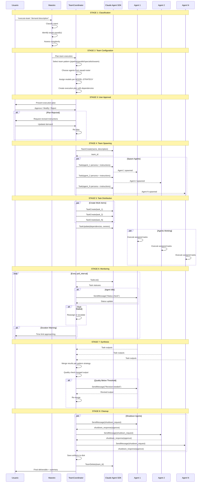
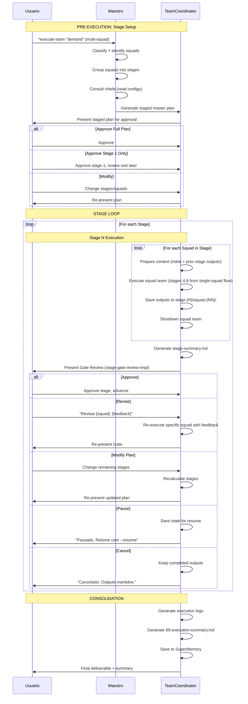

# Workflow: Executar com Team
## Fluxo de Execucao com Time de Agentes (Agent Teams)

---

## Visao Geral

### Proposito
Orquestrar a execucao de demandas complexas criando times de agentes que trabalham em paralelo, usando Claude Agent SDK (TeamCreate, TaskCreate, SendMessage) para distribuir trabalho, monitorar progresso e sintetizar resultados.

### Trigger
Comando `*execute-team` ou demanda classificada como complexa pelo Maestro.

### Output Esperado
- Demanda executada por time de agentes em paralelo
- Resultado sintetizado e unificado
- Artefatos salvos em `.data/team-outputs/{session-id}/`

---

## Diagrama de Fluxo



---

## Etapas Detalhadas

### Stage 1: Classification
| Campo | Valor |
|-------|-------|
| **Agente Responsavel** | Maestro (orquestrador-global) |
| **Input** | User demand text |
| **Output** | Classified intent with domain, complexity, urgency |
| **Criterio de Sucesso** | Confidence >= 0.70 |

**Acoes:**
1. Parse user command and extract demand text
2. Run intent classification (domain, task_type, complexity)
3. Check if demand requires multi-squad coordination
4. Determine if team execution is warranted vs single-agent

```yaml
classification:
  input: "demand text from user"
  output:
    domain: "marketing"
    task_type: "create"
    complexity: "high"
    urgency: "normal"
    multi_squad: false
    team_warranted: true
    reason: "Multiple parallel subtasks identified"
```

**Error Handling:**
| Erro | Acao |
|------|------|
| Cannot classify | Ask user for clarification |
| Low confidence | Present interpretation for confirmation |
| Team not needed | Fallback to `*execute` single-agent mode |

---

### Stage 2: Team Configuration
| Campo | Valor |
|-------|-------|
| **Agente Responsavel** | TeamCoordinator |
| **Input** | Classified intent, squad roster, MODEL-STRATEGY |
| **Output** | Complete execution plan |
| **Criterio de Sucesso** | Valid plan with no circular dependencies |

**Acoes:**
1. Select team pattern based on complexity and task structure
2. Choose agents from target squad roster
3. Assign model tiers (opus for lead, sonnet for specialists, haiku for workers)
4. Break demand into subtasks with dependencies
5. Create execution plan document

```yaml
team_config:
  pattern: "parallel"
  squad: "copywriting"
  agents:
    - name: "copywriter-lead"
      model: "opus"
      role: "coordination and final review"
    - name: "headline-writer"
      model: "sonnet"
      role: "headline and hook creation"
    - name: "body-writer"
      model: "sonnet"
      role: "long-form copy"
  tasks:
    - id: "t1"
      subject: "Research target audience"
      owner: "copywriter-lead"
      blockedBy: []
    - id: "t2"
      subject: "Write headlines"
      owner: "headline-writer"
      blockedBy: ["t1"]
    - id: "t3"
      subject: "Write body copy"
      owner: "body-writer"
      blockedBy: ["t1"]
    - id: "t4"
      subject: "Review and finalize"
      owner: "copywriter-lead"
      blockedBy: ["t2", "t3"]
```

**Error Handling:**
| Erro | Acao |
|------|------|
| No agents available | Suggest alternative squad |
| Pattern mismatch | Re-evaluate with different pattern |
| Too many agents | Cap at max_agents, prioritize |

---

### Stage 3: User Approval
| Campo | Valor |
|-------|-------|
| **Agente Responsavel** | TeamCoordinator |
| **Input** | Execution plan |
| **Output** | Approved/modified/rejected plan |
| **Criterio de Sucesso** | User confirms plan |

**Acoes:**
1. Present execution plan in readable format
2. Show: agents, tasks, dependencies, estimated time, model costs
3. Wait for user response: approve / modify / reject
4. If modified: adjust plan and re-present
5. If rejected: ask for new instructions or cancel

```yaml
approval_prompt:
  show:
    - team_pattern: "parallel"
    - agents: 3
    - tasks: 4
    - estimated_time: "~2min"
    - model_costs: "1 opus + 2 sonnet"
  options:
    - "Approve and execute"
    - "Modify plan"
    - "Cancel"
```

**Error Handling:**
| Erro | Acao |
|------|------|
| User timeout | Remind after 2min, cancel after 5min |
| User rejects | Ask for revised instructions |

---

### Stage 4: Team Spawning
| Campo | Valor |
|-------|-------|
| **Agente Responsavel** | TeamCoordinator |
| **Input** | Approved execution plan |
| **Output** | Running team with spawned agents |
| **Criterio de Sucesso** | All agents spawned and responsive |

**Acoes:**
1. Call TeamCreate with team name and description
2. For each agent in plan: spawn via Task tool with persona and instructions
3. Verify each agent spawned successfully
4. Send initial briefing to each agent via SendMessage

```yaml
spawn:
  team_create:
    name: "team-copywriting-20260206-1430"
    description: "Team for LP copy creation"
  agents_spawned: 3
  all_responsive: true
```

**Error Handling:**
| Erro | Acao |
|------|------|
| TeamCreate fails | Retry once, then fallback to *execute |
| Agent spawn fails | Skip agent, redistribute tasks |
| Agent unresponsive | Replace with new spawn |

---

### Stage 5: Task Distribution
| Campo | Valor |
|-------|-------|
| **Agente Responsavel** | TeamCoordinator |
| **Input** | Spawned agents, task list |
| **Output** | Tasks created and assigned with dependencies |
| **Criterio de Sucesso** | All tasks created with correct owners and blockers |

**Acoes:**
1. TaskCreate for each work item
2. TaskUpdate to set dependencies (addBlockedBy)
3. TaskUpdate to assign owners
4. Agents automatically start working on unblocked tasks

```yaml
distribution:
  tasks_created: 4
  dependencies_set: true
  owners_assigned: true
  unblocked_tasks: ["t1"]  # ready to start immediately
```

**Error Handling:**
| Erro | Acao |
|------|------|
| TaskCreate fails | Retry, adjust task decomposition |
| Dependency error | Validate DAG, fix cycles |

---

### Stage 6: Monitoring
| Campo | Valor |
|-------|-------|
| **Agente Responsavel** | TeamCoordinator |
| **Input** | Running team |
| **Output** | Continuous status, alerts, interventions |
| **Criterio de Sucesso** | All tasks progress to completion |

**Acoes:**
1. Poll TaskList at regular intervals
2. Detect idle agents, stalled tasks, blocked chains
3. Send alerts via SendMessage
4. Auto-reassign tasks when thresholds exceeded
5. Report progress to user periodically

See `team-monitor.md` task for full monitoring specification.

**Error Handling:**
| Erro | Acao |
|------|------|
| Agent stuck | SendMessage warning, then reassign |
| Deadlock | Break dependency, escalate to user |
| Timeout | Trigger partial delivery |

---

### Stage 7: Synthesis
| Campo | Valor |
|-------|-------|
| **Agente Responsavel** | TeamCoordinator |
| **Input** | All completed task outputs |
| **Output** | Unified deliverable |
| **Criterio de Sucesso** | Quality score >= 85% |

**Acoes:**
1. Collect outputs from all completed tasks via TaskGet
2. Merge results according to team pattern strategy
3. Run quality check (completeness, consistency, quality)
4. If below threshold: request revision from specific agents
5. Format final deliverable

```yaml
synthesis:
  merge_strategy: "parallel"  # combine independent outputs
  quality_score: 0.92
  revisions_needed: 0
  final_output: "Complete LP copy package"
```

**Error Handling:**
| Erro | Acao |
|------|------|
| Missing outputs | Deliver partial with note |
| Quality below threshold | Request revision, max 2 rounds |
| Merge conflict | TeamCoordinator resolves manually |

---

### Stage 8: Cleanup
| Campo | Valor |
|-------|-------|
| **Agente Responsavel** | TeamCoordinator |
| **Input** | Synthesized result, running team |
| **Output** | Team shut down, artifacts saved, summary presented |
| **Criterio de Sucesso** | Clean exit, all data preserved |

**Acoes:**
1. Send shutdown_request to all agents
2. Collect shutdown_response (approve/reject)
3. Save all artifacts to `.data/team-outputs/{session-id}/`
4. TeamDelete to free resources
5. Present final summary to user

See `team-shutdown.md` task for full shutdown specification.

**Error Handling:**
| Erro | Acao |
|------|------|
| Agent rejects shutdown | Force after grace period |
| Save fails | Output to console as fallback |
| TeamDelete fails | Log for manual cleanup |

---

## Multi-Squad Staged Execution

When a demand requires multiple squads (2+), the workflow groups them into **stages with approval gates** between each stage.

### Decision Point

```yaml
mode_decision:
  single_squad: "len(squad_sequence) == 1 → execute normally (stages 1-8 above)"
  multi_squad_staged: "len(squad_sequence) >= 2 → staged execution with gates"
  skip_gates: "skip_gates == true → sequential without gates (legacy mode)"
```

### Staged Flow

```yaml
staged_execution:
  detection: "During Stage 1, if demand spans multiple domains or requires 2+ squads"
  strategy: "staged_teams_with_gates"

  pre_execution:
    step_1: "Group squads into logical stages"
    step_2: "Consult chiefs (read squad configs via consult-chief task)"
    step_3: "Generate staged master plan with chief reports"
    step_4: "Present for user approval (full plan or stage-1 only)"

  flow_per_stage:
    step_1: "Create output directory stage-{N}/"
    step_2: "For each squad in stage: prepare context → execute-team → save outputs → shutdown"
    step_3: "Generate stage-summary.md (template: stage-summary-tmpl)"
    step_4: "Present gate review (template: stage-gate-review-tmpl)"
    step_5: "Await user decision"

  gate_options:
    approve: "Accept deliverables, advance to next stage"
    revise: "Re-execute specific squad(s) with feedback"
    modify_plan: "Alter remaining stages (add/remove squads, reorder)"
    pause: "Save state for later resume (*execute-team --resume)"
    cancel: "Stop execution, keep completed stage outputs"

  example:
    - stage: 1
      name: "Pesquisa & Inteligencia"
      squads: ["deep-scraper"]
      gate: "Revisar pesquisa de mercado"
    - stage: 2
      name: "Copy + Design System"
      squads: ["copywriting", "design-system"]
      gate: "Revisar copy e design tokens"
    - stage: 3
      name: "Assets Visuais"
      squads: ["creative-studio"]
      gate: "Revisar assets"
    - stage: 4
      name: "Desenvolvimento"
      squads: ["full-stack-dev"]
      gate: "Pagina entregue"

  handoff:
    between_stages:
      - "Stage N outputs are passed as context to Stage N+1"
      - "All previous stage outputs accumulate (Stage 3 receives Stage 1 + 2 outputs)"
      - "Context is file-based via team-outputs directory"
    within_stage:
      - "Squads within same stage execute sequentially (1 team per session limit)"
      - "Each squad receives context_initial + previous stage outputs"
      - "Handoff document generated between squads via team-context-handoff-tmpl"

  auto_stage_grouping:
    rules:
      - "Research/data squads first (deep-scraper, data-analytics)"
      - "Content/strategy squads after research (copywriting, creative-studio)"
      - "Build squads after content (full-stack-dev, design-system)"
      - "Distribution squads last (media-buy, social-publisher)"
      - "Squads without inter-dependency can share a stage"

  execution_logging:
    rule: ".claude/rules/execution-logging.md"
    team_outputs: ".data/team-outputs/{session-id}/stage-{N}/squad-{NN}-{name}/"
    execution_logs: ".data/executions/{YYYY-MM-DD}_{slug}/"
    mandatory_files:
      - "00-master-plan.md"
      - "{NN}-{squad}-input.md (per squad)"
      - "{NN}-{squad}-output.md (per squad)"
      - "99-execution-summary.md"

  related_tasks:
    - "execute-multi-squad-team (task principal)"
    - "consult-chief (consulta ao chief durante planejamento)"
  related_templates:
    - "team-execution-plan-tmpl (plano master staged)"
    - "stage-summary-tmpl (resumo por stage)"
    - "stage-gate-review-tmpl (gate de aprovacao)"
    - "team-context-handoff-tmpl (handoff entre squads)"
```

### Staged Flow Diagram



---

## Tratamento de Erros Global

| Erro | Causa | Acao |
|------|-------|------|
| Demand unclear | Ambiguous user input | Ask for clarification before proceeding |
| No suitable squad | Demand outside system capabilities | Inform user, suggest alternatives |
| All agents fail | System issue or bad instructions | Fallback to single-agent *execute |
| Network/API error | Infrastructure issue | Retry with backoff, then escalate |
| Context too large | Too many tasks/outputs | Chunk and process in batches |
| User cancels mid-execution | User issues cancel command | Graceful shutdown, save progress |

---

## SLAs e Timeouts

| Etapa | Timeout | Acao se exceder |
|-------|---------|-----------------|
| Classification | 10s | Use partial classification |
| Team Config | 15s | Use default pattern |
| User Approval | 5min | Remind, then cancel |
| Spawn per agent | 30s | Skip agent, redistribute |
| Total spawn | 60s | Partial team start |
| Monitoring poll | 30s | Use previous state |
| Total execution | 10min | Force shutdown + partial delivery |
| Synthesis | 30s | Deliver raw outputs |
| Shutdown per agent | 30s | Force terminate |
| Total shutdown | 60s | Force cleanup |

---

## Metricas Coletadas

| Metrica | Descricao | Uso |
|---------|-----------|-----|
| Total execution time | End-to-end duration | Performance |
| Spawn time | Time to create team | Infrastructure health |
| Agent utilization | Active vs idle ratio | Efficiency |
| Parallel efficiency | Actual vs theoretical speedup | Pattern optimization |
| Tasks completed | Success rate | Reliability |
| Quality score | Output quality | Quality assurance |
| Model cost | Tokens by model tier | Cost optimization |
| Issue count | Monitoring alerts triggered | Stability |
| Reassignment count | Tasks reassigned | Team balance |
| Multi-squad overhead | Handoff time between squads | Process optimization |

---

## Metadados

| Campo | Valor |
|-------|-------|
| Versao | 2.0.0 |
| Criado em | 2026-02-06 |
| Atualizado em | 2026-02-08 |
| Autor | Mega Brain-Core |
| Squad | orquestrador-global |
| Tipo | Workflow Principal |
| Prioridade | P0 |
| Tarefas Relacionadas | execute-team, execute-multi-squad-team, consult-chief, team-status, team-monitor, team-shutdown |
| Templates Relacionados | team-execution-plan-tmpl, stage-summary-tmpl, stage-gate-review-tmpl, team-context-handoff-tmpl |

## MEGABRAIN Deep Validation

- Last run: `20260514-validate-deep`
- Validator: `mega-brain/megabrain-chief`
- Mode: `deep`
- Workflow ID: `executar-com-team`
- Status: `pass`
- External execution: not performed during structural validation.
